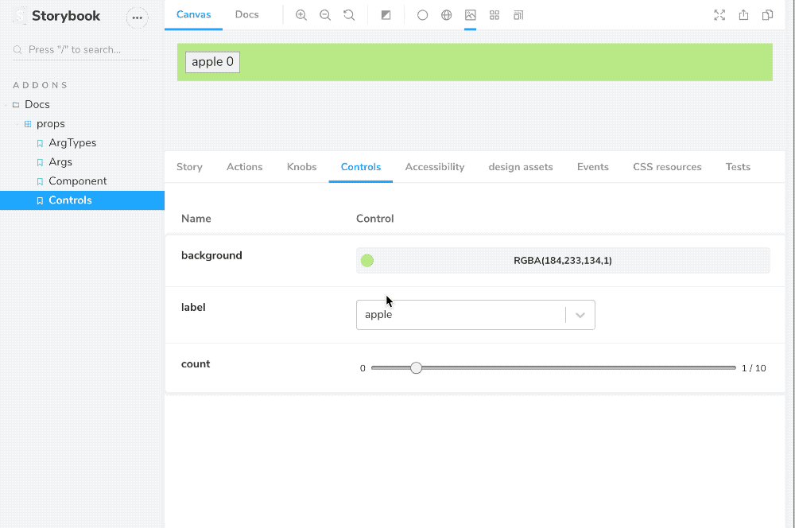

<center>
  

</center>

<h1>Storybook Addon Controls</h1>

Storybook Controls provides UI to interactive to edit the properties of your components and stories.

Controls replaces [Storybook Knobs](https://github.com/storybookjs/storybook/tree/master/addons/knobs) and offers the following improvements:

- **Convenience.** Auto-generated based on your components (even for non-React frameworks)
- **Compatibility.** Controls is based on [Storybook Args](https://github.com/storybookjs/storybook/blob/next/docs/src/pages/formats/component-story-format/index.md#args-story-inputs), so stories written for Controls will be portable:
  - **Documentation.** Controls 100% compatible with [Storybook Docs](https://github.com/storybookjs/storybook/tree/next/addons/docs).
  - **Testing.** Re-use stories directly inside testing tools like [Jest](https://jestjs.io/).
  - **And more.** Re-use stories in design and development tools as Args is adopted.

Most importantly, Controls incorporates lessons from years of supporting Knobs on tens of thousands of projects and dozens of different frameworks. We couldn't incrementally fix knobs, so we built a better version.

- [Get started](#get-started)
- [Installation](#installation)
- [Writing stories](#writing-stories)
  - [Auto-generated args](#auto-generated-args)
  - [Manually-configured args](#manually-configured-args)
- [Migrating from knobs](#migrating-from-knobs)
  - [Knobs to auto-generated args](#knobs-to-auto-generated-args)
  - [Knobs to manually-configured args](#knobs-to-manually-configured-args)
- [Available controls](#available-controls)
- [Parameters](#parameters)
    - [expanded](#expanded)
- [FAQs](#faqs)
  - [How will this replace addon-knobs?](#how-will-this-replace-addon-knobs)

## Get started

To get started with `addon-controls`:

1. [install the addon](#installation)
2. [write an args story](#writing-stories)
3. [configure the addon (optional)](#configuration)

If you're installing it into an existing project that uses `addon-knobs`, you might also [migrate your existing stories](#migrating-from-knobs).

## Installation

In the first version, Controls requires that you're [Storybook Docs](https://github.com/storybookjs/storybook/tree/master/addons/docs). If you're not using it already, please install that first.

Next, install the package:

```sh
npm install @storybook/addon-controls -D # or yarn
```

And add it to your `.storybook/main.js` config:

```js
module.exports = {
  addons: ['@storybook/addon-controls'],
};
```

Once the addon is installed you should see a `Controls` tab in the addons panel:

## Writing stories

Controls are only available for stories that make use of [Storybook Args](https://github.com/storybookjs/storybook/blob/next/docs/src/pages/formats/component-story-format/index.md#args-story-inputs), so if your story functions don't accept an `Args` object as the first argument, you'll need to upgrade your stories.

Here's a `react` story that doesn't use args:

```js
export const Basic = () => <Button label="hello" />;
```

And here's one that does:

```js
export const Basic = (args = { label: 'hello' }) => <Button {...args} />;
```

There are a few different ways to get from here to there:

- The quickest way to do this is to use [auto-generated args](#auto-generated-args).
- If you're implementing custom story logic based on control value, you should use [manually-configured args](#manually-configured-args)
- And if you're adding this to an existing project that's already using knobs, you should [migrate it](#migrating-from-knobs).

### Auto-generated args

In the example above, [Storybook Docs](https://github.com/storybookjs/storybook/tree/next/addons/docs) automatically annotates the `Button` with `ArgTypes` metadata that allows `Controls` to automatically create rows for that component.

So if the full story was:

```js
import { Button } from './Button';
export default { title: 'Button', component: Button };

export const Basic = () => <Button label="hello" />;
```

You could simply rewrite it as:

```js
export const Basic = (args = { label: 'hello' }) => <Button {...args} />;
```

### Manually-configured args

Auto-generated args make sense when the controls correspond exactly to component. But there are cases where you want controls to control something about the story instead of (or in addition to) the component properties.

Consider the following example that shows reflow behavior of an array of `Button` instances inside a `ButtonGroup` container:

```js
import range from 'lodash/range';
import { Button, ButtonGroup } from '.';

export const Reflow = ({ count }) => (
  <ButtonGroup>
    {range(count).map((i) => (
      <Button label={`button ${i}`} />
    ))}
  </ButtonGroup>
);
```

In this case, we need to specify `ArgTypes` metadata about the story to render properly:

```js
Reflow.story = {
  argTypes: {
    count: { control: { type: 'range', min: 0, max: 100 } },
  },
};
```

This is the same kind of data that gets filled in automatically in the [auto-generated args case](#auto-generated-args).

## Migrating from knobs

If you're already using [Storybook Knobs](https://github.com/storybookjs/storybook/tree/master/addons/knobs) you should consider migrating to Controls.

're probably using it for something that can be satisfied by one of the two previous cases, or [manually-configured args](#manually-configured-args).

Let's consider a few different knobs-based stories.

### Knobs to auto-generated args

First, let's consider a knobs version of a basic story that fills in the props for a component:

```js
import { text } from '@storybook/addon-knobs';
import { Button } from './Button';

export const Basic = () => <Button label={text('Label', 'hello')} />;
```

This fills in the Button's label based on a knob, which is exactly the [auto-generated](#auto-generated-args) use case above. So we can rewrite it using auto-generated args:

```js
export const Basic = (args = { label: 'hello' }) => <Button {...args} />;
```

### Knobs to manually-configured args

Similarly, we can also consider a story that uses knob inputs to change its behavior:

```js
import range from 'lodash/range';
import { number } from '@storybook/addon-knobs';

export const Reflow = () => {
  const count = number('Count', 10, { min: 0, max: 100, range: true });
  return (
    <ButtonGroup>
      {range(count).map((i) => (
        <Button label={`button ${i}`} />
      ))}
    </ButtonGroup>
  );
};
```

And again, as above, this can be rewritten using [manually-configured args](#manually-configured-args):

```js
export const Reflow = ({ count }) => (
  <ButtonGroup>
    {range(count).map((i) => (
      <Button label={`button ${i}`} />
    ))}
  </ButtonGroup>
);
Reflow.story = {
  argTypes: {
    count: { control: { type: 'range', min: 0, max: 100 } },
  },
};
```

## Available controls

FIXME

## Parameters

Controls supports the following configuration parameters, either [globally or on a per-story basis](https://storybook.js.org/docs/basics/writing-stories/#parameters):

#### expanded

Since Controls is built on the same engine as Storybook Docs, it can also show property documentation alongside your controls using the `expanded` parameter (defaults to `false`).

To enable expanded mode globally, add the following to `.storybook/preview.js`:

```js
export const parameters = {
  controls: { expanded: true },
};
```

And here's what the resulting UI looks like:

> FIXME

## FAQs

### How will this replace addon-knobs?

Addon-knobs is one of Storybook's most popular addons with over 1M weekly downloads, so we know lots of users will be affected by this change. Knobs is also a mature addon, with various options that are not available in addon-controls.

Therefore, rather than deprecating addon-knobs immediately, we will continue to release knobs with the Storybook core distribution until 7.0. This will give us time to improve Controls based on user feedback, and also give knobs users ample time to migrate.

If you are somehow tied to knobs or prefer the knobs interface, we are happy to take on maintainers for the knobs project. If this interests you, hop on our [Discord](https://discord.gg/UUt2PJb).
