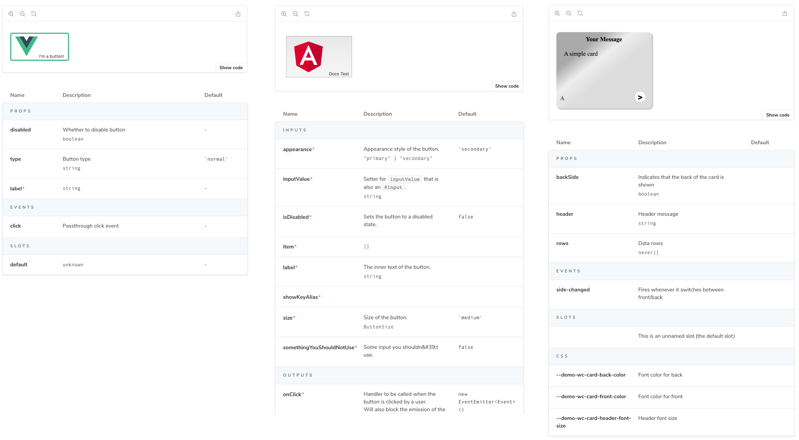
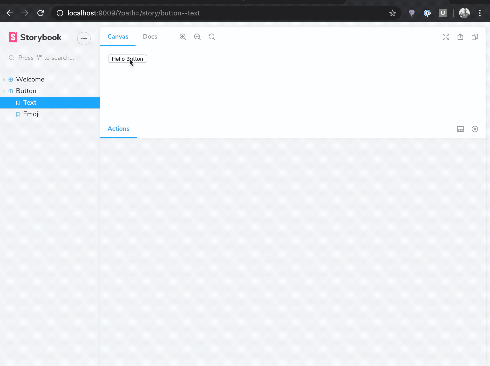

<center>
  
</center>

<h1>Storybook Docs Props Tables</h1>

Storybook Docs automatically generates props tables for components in supported frameworks. This document is a consolidated summary of prop tables, provides instructions for reporting bugs, and list known limitations for each framework.

- [Usage](#usage)
  - [DocsPage](#docspage)
  - [MDX](#mdx)
- [Controls](#controls)
- [Customization](#customization)
  - [Customizing ArgTypes](#customizing-argtypes)
  - [Custom ArgTypes in MDX](#custom-argtypes-in-mdx)
- [Reporting a bug](#reporting-a-bug)
- [Known limitations](#known-limitations)
- [More resources](#more-resources)

## Usage

For framework-specific setup instructions, see the framework's README: [React](../react/README.md), [Vue](../vue/README.md), [Angular](../angular/README.md), [Web Components](../web-components/README.md), [Ember](../ember/README.md).

### DocsPage

To use the props table in [DocsPage](./docspage.md), simply export a component property on your stories metadata:

```js
// MyComponent.stories.js
import { MyComponent } from './MyComponent';

export default {
  title: 'MyComponent',
  component: MyComponent,
};
// stories etc...
```

### MDX

To use the props table in [MDX](./mdx.md), use the `ArgsTable` block:

```js
// MyComponent.stories.mdx
import { ArgsTable } from '@storybook/addon-docs/blocks';
import { MyComponent } from './MyComponent';

# My Component!

<ArgsTable of={MyComponent} />
```

## Controls

Starting in SB 6.0, the `ArgsTable` block has built-in `Controls` (formerly known as "knobs") for editing stories dynamically.

<center>
  
</center>

<br/>

These controls are implemented appear automatically in the props table when your story accepts [Storybook Args](https://storybook.js.org/docs/react/api/csf#args-story-inputs) as its input. This is done slightly differently depending on whether you're using `DocsPage` or `MDX`.

**DocsPage.** In [DocsPage](./docspage.md), simply write your story to consume args and the auto-generated props table will display controls in the right-most column:

```js
export default {
  title: 'MyComponent',
  component: MyComponent,
};

export const WithControls = (args) => <MyComponent {...args} />;
```

**MDX.** In [MDX](./mdx.md), the `ArgsTable` controls are more configurable than in DocsPage. In order to show controls, `ArgsTable` must be a function of a story, not a component:

```js
<Story name="WithControls">
  {args => <MyComponent {...args} />}
</Story>

<ArgsTable story="Controls" />
```

For a very detailed walkthrough of how to write stories that use controls, see the [addon-controls README](https://github.com/storybookjs/storybook/blob/next/addons/controls/README.md#writing-stories).

## Customization

Props tables are automatically inferred from your components and stories, but sometimes it's useful to customize the results.

Props tables are rendered from an internal data structure called `ArgTypes`. When you declare a story's `component` metadata, Docs automatically extracts `ArgTypes` based on the component's properties.

You can can customize what's shown in the props table by [customizing the `ArgTypes` data](#customizing-argtypes). This is currently available for `DocsPage` and `<ArgsTable story="xxx">` construct, but not for the `<ArgsTable of={component} />` construct,

### Customizing ArgTypes

> **NOTE:** This API is experimental and may change outside of the typical semver release cycle

When you declare a `component` in for your `DocsPage` [as described above](#docspage) or use the `<ArgsTable story="xxx" />` construct [in MDX](#controls), the props table shows the `story.argTypes` that gets extracted by Storybook.

Consider the following input:

```js
// Button.js
import React from 'react';
import PropTypes from 'prop-types';
export const Button = ({ label }) => <button>{label}</button>;
Button.propTypes = {
  /** demo description */
  label: PropTypes.string,
};
Button.defaultProps = {
  label: 'Hello',
};

// Button.stories.js
export default { title: 'Button', component: Button };
```

This generates the equivalent of following in-memory data structure for the `Button` component:

```js
const argTypes = {
  label: {
    name: 'label',
    type: { name: 'string', required: false },
    defaultValue: 'Hello',
    description: 'demo description',
    table: {
      type: { summary: 'string' },
      defaultValue: { summary: 'Hello' },
    }
    control: {
      type: 'text'
    }
  }
}
```

In this `ArgTypes` data structure, `name`, `type`, `defaultValue`, and `description` are standard fields in all `ArgTypes` (analogous to `PropTypes` in React). The `table` and `control` fields are addon-specific annotations. So, for example, the `table` annotation provides extra information to customize how `label` gets rendered, and the `control` annotation provides extra information for the control for editing the property.

As a user, you can customize the prop table by selectively overriding these values. Consider the following modification to `Button.stories.js` from above:

```js
export default {
  title: 'Button',
  component: Button,
  argTypes: {
    label: {
      description: 'overwritten description',
      table: {
        type: { summary: 'something short', detail: 'something really really long' },
      },
      control: {
        type: null,
      },
    },
  },
};
```

These values--`description`, `table.type`, and `controls.type`--get merged over the defaults that are extracted by Storybook. The final merged values would be:

```js
const argTypes = {
  label: {
    name: 'label',
    type: { name: 'string', required: false },
    defaultValue: 'Hello',
    description: 'overwritten description',
    table: {
      type: { summary: 'something short', detail: 'something really really long' },
      defaultValue: { summary: 'Hello' },
    }
    control: {
      type: null
    }
  }
}
```

This would render a row with a modified description, a type display with a dropdown that shows the detail, and no control.

> **NOTE:** `@storybook/addon-docs` provide shorthand for common tasks:
>
> - `type: 'number'` is shorthand for `type: { name: 'number' }`
> - `control: 'radio'` is shorthand for `control: { type: 'radio' }`

Controls customization has an entire section in the [`addon-controls` README](https://github.com/storybookjs/storybook/blob/next/addons/controls/README.md#configuration).

Here are the possible customizations for the rest of the prop table:

| Field                        | Description                                                                                                               |
| ---------------------------- | ------------------------------------------------------------------------------------------------------------------------- |
| `name`                       | The name of the property                                                                                                  |
| `type.required`              | Whether or not the property is required                                                                                   |
| `description`                | A markdown description for the property                                                                                   |
| `table.type.summary`         | A short version of the type                                                                                               |
| `table.type.detail`          | A longer version of the type (if it's a complex type)                                                                     |
| `table.defaultValue.summary` | A short version of the default value                                                                                      |
| `table.defaultValue.detail`  | A longer version of the default value (if it's a complex value)                                                           |
| `control`                    | See [`addon-controls` README](https://github.com/storybookjs/storybook/blob/next/addons/controls/README.md#configuration) |

### Custom ArgTypes in MDX

To do the equivalent of the above customization [in MDX](./mdx.md), use the following.

Overriding at the component level:

```jsx
<Meta
  title="MyComponent"
  component={MyComponent}
  argTypes={{
    label: { name: 'label' /* ... */ },
  }}
/>
```

And at the story level:

```jsx
<Story name="some story" argTypes={{
  label: { name: 'label', ... }
}}>
  {/* story contents */}
</Story>
```

## Reporting a bug

Extracting component properties from source is a tricky problem with thousands of corner cases. We've designed this package and its tests to accurately isolate problems, since the cause could either be in this package or (likely) one of the packages it depends on.

If you're seeing a problem with your prop table, here's what to do.

First, look to see if there's already a test case that corresponds to your situation. If there is, it should be documented in the [Known Limitations](#known-limitations) section below. There should also be one or more corresponding test fixtures contained in this package. For example, if you are using React, look under the directory `./src/frameworks/react/__testfixtures__`.

If your problem is not already represented here, do the following:

1. Create a **MINIMAL** repro for your problem. Each case should be just a few lines of code.
2. Place it in the appropriate directory `./src/frameworks/<framework>/__testfixtures__/`, e.g. `./src/frameworks/react/__testfixtures__/XXXX-some-description`, where `XXXX` is the corresponding github issue.
3. Run the tests for your `<framework>`, e.g. `yarn jest --testPathPattern=react-properties.test.ts --watch`
4. Inspect the output files for your test case.
5. Add the example to the appropriate stories file, e.g. `react-properties.stories.ts` for `react`, for a visual repro

If the problem appears to be an issue with this library, file an issue and include a PR that includes your repro.

If the problem appears to be an issue with the sub-package, please file an issue on the appropriate sub-package, document the limitation in [Known Limitations](#known-limitations) below, link to that issue, and submit a PR including the updated documentation and fixtures/snapshots.

## Known limitations

This package relies on a variety of sub-packages to extract property information from components. Many of the bugs in this package correspond to bugs in a sub-package. Since we don't maintain the sub-packages, the best we can do for now is (1) document these limitations, (2) provide clean reproductions to the sub-package, (3) optionally provide PRs to those packages to fix the problems.

| Framework      | Underlying library                       | Docs                                             | Open issues                                                                                                                                                        |
| -------------- | ---------------------------------------- | ------------------------------------------------ | ------------------------------------------------------------------------------------------------------------------------------------------------------------------ |
| React          | `react-docgen` `react-docgen-typescript` | [Docs](../react/README.md#props-tables)          | [Open issues](https://github.com/storybookjs/storybook/issues?q=is%3Aopen+is%3Aissue+label%3A%22block%3A+props%22+label%3Abug+label%3A%22app%3A+react%22)          |
| Vue            | `vue-docgen-api`                         | [Docs](../vue/README.md#props-tables)            | [Open issues](https://github.com/storybookjs/storybook/issues?q=is%3Aopen+is%3Aissue+label%3A%22block%3A+props%22+label%3Abug+label%3A%22app%3A+vue%22)            |
| Angular        | `compodoc`                               | [Docs](../angular/README.md#props-tables)        | [Open issues](https://github.com/storybookjs/storybook/issues?q=is%3Aopen+is%3Aissue+label%3A%22block%3A+props%22+label%3Abug+label%3A%22app%3A+angular%22)        |
| Web-components | `custom-elements.json`                   | [Docs](../web-components/README.md#props-tables) | [Open issues](https://github.com/storybookjs/storybook/issues?q=is%3Aopen+is%3Aissue+label%3A%22block%3A+props%22+label%3Abug+label%3A%22app%3A+web-components%22) |
| Ember          | `yui-doc`                                | [Docs](../ember/README.md#props-tables)          | [Open issues](https://github.com/storybookjs/storybook/issues?q=is%3Aopen+is%3Aissue+label%3A%22block%3A+props%22+label%3Abug+label%3A%22app%3A+ember%22)          |

## More resources

- References: [README](../README.md) / [DocsPage](docspage.md) / [MDX](mdx.md) / [FAQ](faq.md) / [Recipes](recipes.md) / [Theming](theming.md) / [Props](props-tables.md)
- Framework-specific docs: [React](../react/README.md) / [Vue](../vue/README.md) / [Angular](../angular/README.md) / [Web components](../web-components/README.md) / [Ember](../ember/README.md)
- Announcements: [Vision](https://medium.com/storybookjs/storybook-docs-sneak-peak-5be78445094a) / [DocsPage](https://medium.com/storybookjs/storybook-docspage-e185bc3622bf) / [MDX](https://medium.com/storybookjs/rich-docs-with-storybook-mdx-61bc145ae7bc) / [Framework support](https://medium.com/storybookjs/storybook-docs-for-new-frameworks-b1f6090ee0ea)
- Example: [Storybook Design System](https://github.com/storybookjs/design-system)
