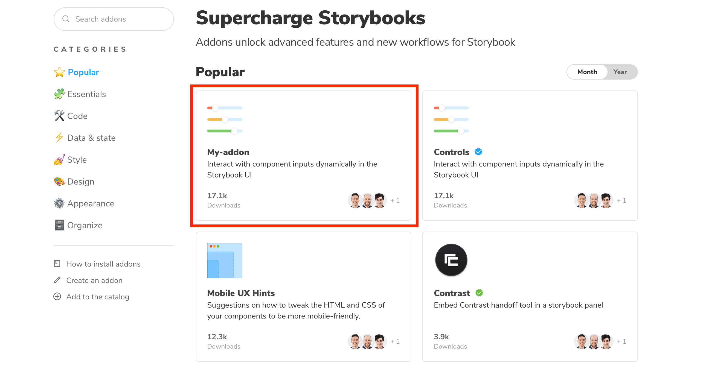

<div class="aside">
The addon catalog is still in <strong>beta</strong> and we plan to release it soon. Let us know of any issues you find.
</div>

Storybook addons as other packages in the Javascript ecosystem are distributed via npm. Before publishing and listing your addon in the catalog, check if the following requirements are met:

- A `package.json` with module related information and catalog metadata
- `README` file with instructions on how to use the addon (installation and configuration)
- `dist` directory containing transpiled ES5 code
- Root level `preset.js` file written as an ES5 module

<div class="aside">

Learn how to write your own Storybook addon [here](./writing-addons.md).

</div>

### Module metadata

The items mentioned above are the baseline requirements for any Storybook addon. But we rely on key pieces of information to feature the addon in the catalog:

| Property    | Description                            | Example                                                               |
| ----------- | -------------------------------------- | --------------------------------------------------------------------- |
| name        | Addon display name                     | My-addon                                                              |
| description | Addon description                      | Sample description                                                    |
| author      | Name of the author                     | Someone                                                               |
| keywords    | List of keywords to describe the addon | `["storybook-addon","layout","debug"]`                                |
| repository  | Addon repository                       |`{"type": "git","url": "https://github.com/someone/my-addon" }`          |

<div class="aside">
To get the addon listed in the catalog, add the <code>storybook-addons</code> as the first keyword, followed by an entry to categorize the addon. Including additional keywords helps with searchability. 
</div>

### Catalog metadata

Along with module related information, you'll need to specify additional metadata. In your `package.json` add the `storybook` property and use the following fields:

| Property              | Description                    | Example           |
| --------------------- | ------------------------------ | ----------------- |
| displayName           | Addon display name             | My-addon          |
| icon                  | Custom icon for the addon      | my-addon-icon.png |
| unsupportedFrameworks | List of unsupported frameworks | Vue               |
| supportedFrameworks   | List of supported frameworks   | React,Angular     |

For instance:

```json
{
  "storybook": {
    "displayName": "My-addon",
    "unsupportedFrameworks": ["Vue"],
    "supportedFrameworks": ["Angular", "React"],
    "icon": "https://my-url/my-addon-icon.png"
  }
}
```



Once you publish the addon, we query npm's registry and add it to the catalog based on the available metadata.

 <div class="aside">

Note: There's a delay between the time you publish your addon and when its listed in the catalog. If your addon isn't showing up, open an issue on the catalog [repository](https://github.com/storybookjs/addon-gallery).

</div>