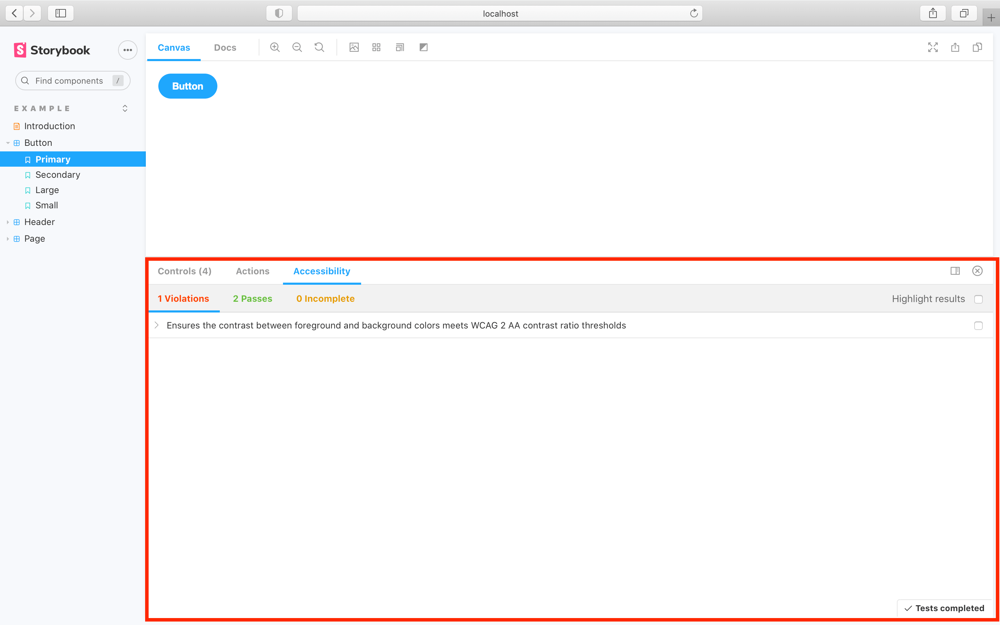

Storybook has [hundreds of reusable addons](/addons) that are packaged as NPM modules. Let's walk through how to extend Storybook by installing and registering addons.

### Using addons

With the exception of preset addons, all addons have the same installation process: install and register.

For example, to include accessibility testing in Storybook, run the following command to install the necessary addon:

```shell
yarn add -D @storybook/addon-a11y
```

Next, update [`.storybook/main.js`](../configure/overview.md#configure-story-rendering) to the following:

<!-- prettier-ignore-start -->

<CodeSnippets
  paths={[
    'common/storybook-main-addon-registration.js.mdx',
  ]}
/>

<!-- prettier-ignore-end -->

<div class="aside">
Addons may also require addon-specific configuration. Read their respective READMEs.
</div>

Now when you run Storybook the accessibility testing addon will be enabled.



### Using preset addons

Storybook preset addons are grouped collections of specific `babel`,`webpack` and `addons` configurations for distinct use cases. Each one with it's own set of instructions. Preset addons have a three-step installation process: install, register and optionally configuration.

For example, to use SCSS styling, run the following command to install the addon and the required dependencies:

```sh
yarn add -D @storybook/preset-scss css-loader sass-loader style-loader
```

Next, update [`.storybook/main.js`](../configure/overview.md#configure-story-rendering) to the following:

<!-- prettier-ignore-start -->

<CodeSnippets
  paths={[
    'common/storybook-main-preset-config.js.mdx',
  ]}
/>

<!-- prettier-ignore-end -->

Now when you run Storybook it will configure itself to use SCSS styling. No further configuration needed.

#### Optional configuration

Most preset addons can also take additional parameters. The most common use cases are:

- Addon configuration
- Webpack loader configuration

Consider the following example:

<!-- prettier-ignore-start -->

<CodeSnippets
  paths={[
    'common/storybook-preset-configuration.js.mdx',
  ]}
/>

<!-- prettier-ignore-end -->

<div class="aside">
Preset addons may also have addon-specific configuration. Read their respective READMEs.
</div>

Now, when Storybook starts up, it will update webpack's CSS loader to use modules and adjust how styling is defined.
