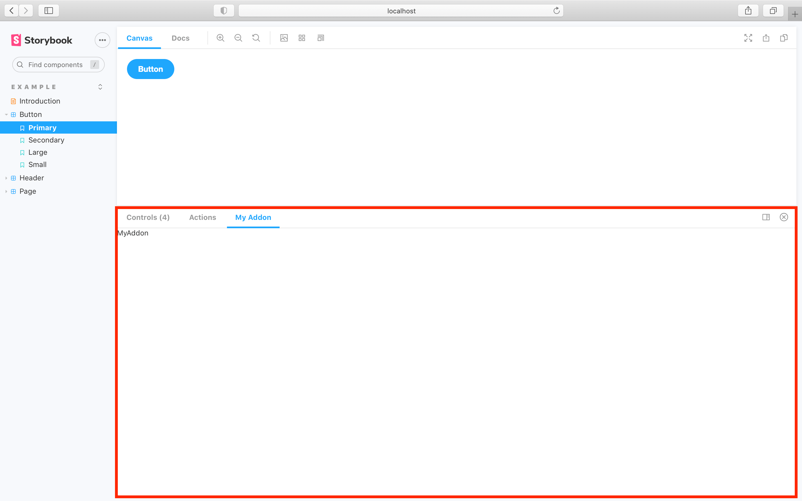

One of Storybook's main features is its robust addon ecosystem. Use addons to enhance and extend your development workflow. This page shows you how to create your own addon.

## What we're building

For this example we're going to build a bare-bones addon which:

- Adds a new panel in Storybook.
- Retrieves a custom parameter from the stories.
- Displays the parameter data in the panel.

### Addon directory structure

We recommend a common addon file and directory structure for consistency.

| Files/Directories | Description                        |
| :---------------- | :--------------------------------- |
| dist              | Transpiled directory for the addon |
| src               | Source code for the addon          |
| .babelrc.js       | Babel configuration                |
| preset.js         | Addon entry point                  |
| package.json      | Addon metadata information         |
| README.md         | General information for the addon  |

### Get started

Open a new terminal and create a new directory called `my-addon`. Inside it run `npm init` to initialize a new node project. For your project's name choose `my-addon` and for entry point `dist/preset.js`.

Once you've gone through the prompts your `package.json` should look like:

```json
{
  "name": "my-addon",
  "version": "1.0.0",
  "description": "A barebones Storybook addon",
  "main": "dist/preset.js",
  "files": ["dist/**/*", "README.md", "*.js"],
  "keywords": ["storybook", "addons"],
  "author": "YourUsername",
  "license": "MIT"
}
```

### Build system

We'll need to add the necessary dependencies and make some adjustments. Run the following commands:

```shell
# Installs React and Babel CLI
yarn add react react-dom @babel/cli

# Adds Storybook:
npx -p @storybook/cli sb init
```

<div class="aside">
Initializing Storybook adds the building blocks for our addon. If you're building a standalone Storybook addon, set the React and Storybook packages as peer dependencies. This prevents the addon from breaking Storybook when there are different versions available.
</div>

Next, create a `.babelrc.js` file in the root directory with the following:

<!-- prettier-ignore-start -->

<CodeSnippets
  paths={[
    'common/my-addon-babel-configuration.js.mdx',
  ]}
/>

<!-- prettier-ignore-end -->

<div class="aside">
Babel configuration is required because our addon uses ES6 and JSX.
</div>

Change your `package.json` and add the following script to build the addon:

```json
{
  "scripts": {
    "build": "babel ./src --out-dir ./dist"
  }
}
```

<div class="aside">
Running <code>yarn build</code> at this stage will output the code into the <code>dist</code> directory, transpiled into a ES5 module ready to be installed into any Storybook.
</div>

Finally, create a new directory called `src` and inside a new file called `preset.js` with the following:

<!-- prettier-ignore-start -->

<CodeSnippets
  paths={[
    'common/my-addon-preset-implementation.js.mdx',
  ]}
/>

<!-- prettier-ignore-end -->

Presets are the way addons hook into Storybook. Among other tasks they allow you to:

- Add to [Storybook's UI](#add-a-panel)
- Add to the [preview iframe](./writing-presets.md#preview-entries)
- Modify [babel](./writing-presets.md#babel) and [webpack settings](./writing-presets.md#webpack)

For this example, we'll just modify Storybook's UI.

### Add a panel

Now let’s add a panel to Storybook. Inside the `src` directory, create a new file called `register.js` and add the following:

<!-- prettier-ignore-start -->

<CodeSnippets
  paths={[
    'common/my-addon-initial-panel-state.js.mdx',
  ]}
/>

<!-- prettier-ignore-end -->

<div class="aside">
Make sure to include the <code>key</code> when you register the addon. This will prevent any issues when the addon renders.
</div>

Going over the code snippet in more detail. When Storybook starts up:

1. It [registers](./addons-api.md#addonsregister) the addon
2. [Adds](./addons-api.md#addonsadd) a new `panel` titled `My Addon` to the UI
3. When selected, the `panel` renders the static `div` content

### Register the addon

Finally, let’s hook it all up. Change `.storybook/main.js` to the following:

<!-- prettier-ignore-start -->

<CodeSnippets
  paths={[
    'common/my-addon-storybook-registration.js.mdx',
  ]}
/>

<!-- prettier-ignore-end -->

<div class="aside">
When you register a Storybook addon, it will look for either <code>register.js</code> or <code>preset.js</code> as the entry points.
</div>

Run `yarn storybook` and you should see something similar to:



### Display story parameter

Next, let’s replace the `MyPanel` component from above to show the parameter.

<!-- prettier-ignore-start -->

<CodeSnippets
  paths={[
    'common/storybook-addon-change-panel.js.mdx',
  ]}
/>

<!-- prettier-ignore-end -->

The new version is made smarter by [`useParameter`](./addons-api.md#useparameter), which is a [React hook](https://reactjs.org/docs/hooks-intro.html) that updates the parameter value and re-renders the panel every time the story changes.

The [addon API](./addons-api.md) provides hooks like this so all of that communication can happen behind the scenes. That means you can focus on your addon's functionality.

### Using the addon with a story

When Storybook was initialized it provided a small set of examples stories. Change your `Button.stories.js` to the following:

<!-- prettier-ignore-start -->

<CodeSnippets
  paths={[
    'react/button-story-with-addon-example.js.mdx',
    'vue/button-story-with-addon-example.js.mdx',
    'angular/button-story-with-addon-example.ts.mdx',
  ]}
/>

<!-- prettier-ignore-end -->

After applying the changes to the story, the Storybook UI will show the following:

<video autoPlay muted playsInline loop>
  <source
    src="addon-final-stage-optimized.mp4"
    type="video/mp4"
  />
</video>

### Root level preset.js

Before publishing the addon, we'll need to make one final change. In the root directory of the addon create a new file called `preset.js` and add the following:

<!-- prettier-ignore-start -->

<CodeSnippets
  paths={[
    'common/my-addon-root-level-preset.js.mdx',
  ]}
/>

<!-- prettier-ignore-end -->

This auto-registers the addon without any additional configuration from the user. Storybook looks for either a `preset.js` or a `register.js` file located at the root level.

### Packaging and publishing

Now that you've seen how to create a bare-bones addon, let's see how to share it with the community. Before we begin, make sure your addon meets the following requirements:

- `package.json` file with metadata about the addon
- Peer dependencies of `react` and `@storybook/addons`
- `preset.js` file at the root level written as an ES5 module
- `src` directory containing the ES6 addon code
- `dist` directory containing transpiled ES5 code on publish
- [GitHub](https://github.com/) account to host your code
- [NPM](https://www.npmjs.com/) account to publish the addon

Reference the [storybook-addon-outline](https://www.npmjs.com/package/storybook-addon-outline) to see a project that meets these requirements.

Learn how to [add to the addon catalog](./addon-catalog.md).

### More guides and tutorials

In the previous example, we introduced the structure of an addon, but barely scratched the surface of what addons can do.

To dive deeper we recommend Storybook's [creating an addon](https://storybook.js.org/tutorials/create-an-addon/) tutorial. It’s an excellent walkthrough that covers the same ground as the above introduction, but goes further and leads you through the full process of creating a realistic addon.

[How to build a Storybook addon](https://www.chromatic.com/blog/how-to-build-a-storybook-addon/) shows you how to create a standalone addon in great detail.

### Addon kit

To help you jumpstart the addon development, the Storybook maintainers created an [`addon-kit`](https://github.com/storybookjs/addon-kit), use it to bootstrap your next addon.
