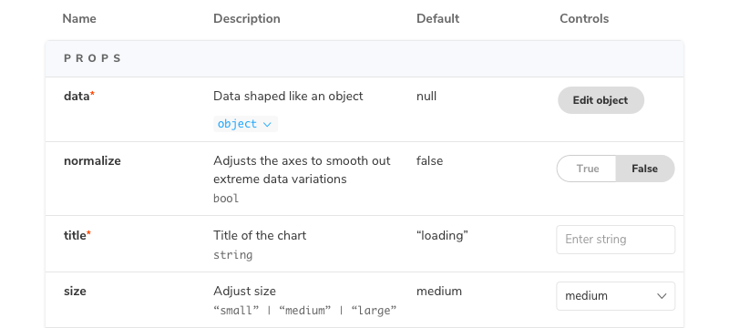

NOTE: This API is experimental and may change outside of the typical semver release cycle

ArgTypes are a first-class feature in Storybook for specifying the behaviour of [Args](../writing-stories/args.md). By specifying the type of an arg you constrain the values that it can take and can also provide information about args that are not explicitly set (i.e. not required).

You can also use argTypes to “annotate” args with information that is used by addons that make use of those args, for instance to instruct the controls addons to render a color choose for a string-valued arg.

The most concrete realization of argTypes is the [Args Table](../writing-docs/doc-blocks.md#argstable) doc block. Each row in the table corresponds to a single argType, as well as the current value of that arg.

## Automatic argType inference

If you are using the Storybook [docs](../writing-docs/introduction.md) addon (installed by default as part of [essentials](../essentials/introduction.md)), then Storybook will infer a set of argTypes for each story based on the `component` specified in the [default export](./csf.md#default-export) of the CSF file.

To do so, Storybook uses various static analysis tools depending on your framework.

- React
  - [react-docgen](https://github.com/reactjs/react-docgen)
  - [react-docgen-typescript](https://github.com/styleguidist/react-docgen-typescript)
- Vue
  - [vue-docgen-api](https://github.com/vue-styleguidist/vue-styleguidist/tree/dev/packages/vue-docgen-api)
- Angular
  - [compodoc](https://compodoc.app/)
- WebComponents
  - [custom-element.json](https://github.com/webcomponents/custom-elements-json)
- Ember
  - [YUI doc](https://github.com/ember-learn/ember-cli-addon-docs-yuidoc#documenting-components)

The format of the generated argType will look something like:

<!-- prettier-ignore-start -->

<CodeSnippets
  paths={[
    'common/storybook-generated-argtypes.js.mdx',
  ]}
/>

<!-- prettier-ignore-end -->

In this ArgTypes data structure, name, type, defaultValue, and description are standard fields in all ArgTypes (analogous to PropTypes in React). The table and control fields are addon-specific annotations. So, for example, the table annotation provides extra information to customize how label gets rendered, and the control annotation provides extra information for the control for editing the property.

`@storybook/addon-docs` provide shorthand for common tasks:

- `type: 'number'` is shorthand for type: { name: 'number' }
- `control: 'radio'` is shorthand for control: { type: 'radio' }

#### Manual specification

If you want more control over the args table or any other aspect of using argTypes, you can overwrite the generated argTypes for you component on a per-arg basis. For instance, with the above inferred argTypes and the following default export:

<!-- prettier-ignore-start -->

<CodeSnippets
  paths={[
    'common/storybook-customize-argtypes.js.mdx',
  ]}
/>

<!-- prettier-ignore-end -->

These values--description, table.type, and controls.type--get merged over the defaults that are extracted by Storybook. The final merged values would be:

<!-- prettier-ignore-start -->

<CodeSnippets
  paths={[
    'common/storybook-merged-argtypes.js.mdx',
  ]}
/>

<!-- prettier-ignore-end -->

In particular, this would render a row with a modified description, a type display with a dropdown that shows the detail, and no control.

#### Using argTypes in addons

If you want to access the argTypes of the current component inside an addon, you can use the `useArgTypes` hook from the `@storybook/api` package:

<!-- prettier-ignore-start -->

<CodeSnippets
  paths={[
    'common/storybook-argtypes-with-addon.js.mdx',
  ]}
/>

<!-- prettier-ignore-end -->
