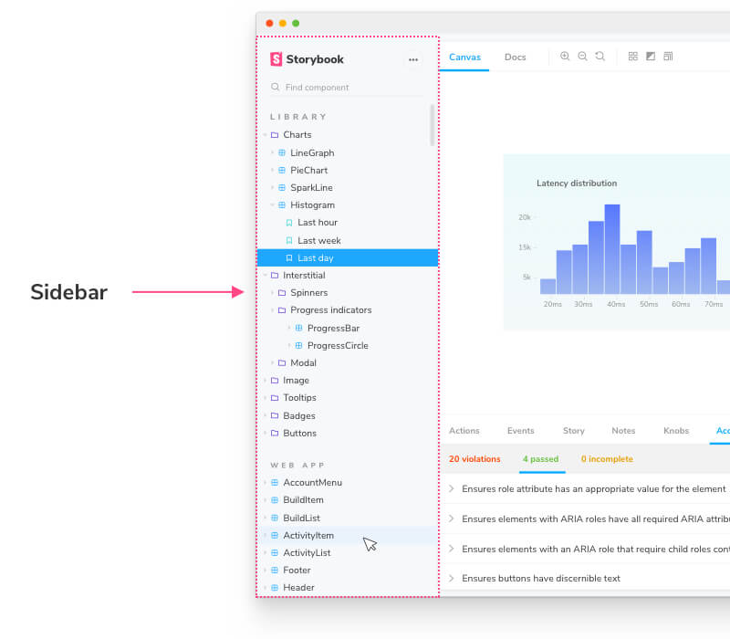
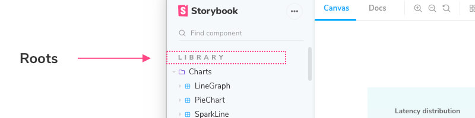

Storybook’s sidebar lists all your stories grouped by component. When you have a lot of components you may wish to also group those components. To do so, you can add the `/` separator to the `title` of your CSF file and Storybook will group the stories into groups based on common prefixes:

We recommend using a nesting scheme that mirrors the filesystem path of the components. For example, if you have a file `components/modals/Alert.js` name the CSF file `components/modals/Alert.stories.js` and title it `Components/Modals/Alert`.

## Roots

By default, Storybook will treat your highest level of groups as “roots”--which are displayed in the UI as “sections” of the hierarchy. Lower level groups are displayed as expandable items in the hierarchy:

If you’d prefer all groups to be expandable, you can set the `showRoots` option to `false` in [`./storybook/manager.js`](./overview.md#configure-story-rendering):

<!-- prettier-ignore-start -->

<CodeSnippets
  paths={[
    'common/storybook-manager-disable-roots.js.mdx',
  ]}
/>

<!-- prettier-ignore-end -->

## Generating titles based on `__dirname`

As a CSF file is a JavaScript file, the exports (including the default export) can be generated dynamically. In particular you can use the `__dirname` variable to generate the title based on the path name (this example uses the paths.macro):

<!-- prettier-ignore-start -->

<CodeSnippets
  paths={[
    'common/component-story-dynamic-title.js.mdx',
  ]}
/>

<!-- prettier-ignore-end -->

## Permalinking to stories

By default, Storybook generates an `id` for each story based on the component title and the story name. This `id` in particular is used in the URL for each story and that URL can serve as a permalink (especially when you [publish](../workflows/publish-storybook.md) your Storybook).

Consider the following story:

<!-- prettier-ignore-start -->

<CodeSnippets
  paths={[
    'common/foo-bar-baz-story.js.mdx',
  ]}
/>

<!-- prettier-ignore-end -->

Storybook's ID-generation logic will give this the `id` `foo-bar--baz`, so the link would be `?path=/story/foo-bar--baz`.

It is possible to manually set the id of a story, which in particular is useful if you want to rename stories without breaking permalinks. Suppose you want to change the position in the hierarchy to `OtherFoo/Bar` and the story name to `Moo`. Here's how to do that:

<!-- prettier-ignore-start -->

<CodeSnippets
  paths={[
    'common/other-foo-bar-story.js.mdx',
  ]}
/>

<!-- prettier-ignore-end -->

Storybook will prioritize the `id` over the title for ID generation, if provided, and will prioritize the `story.name` over the export key for display.
