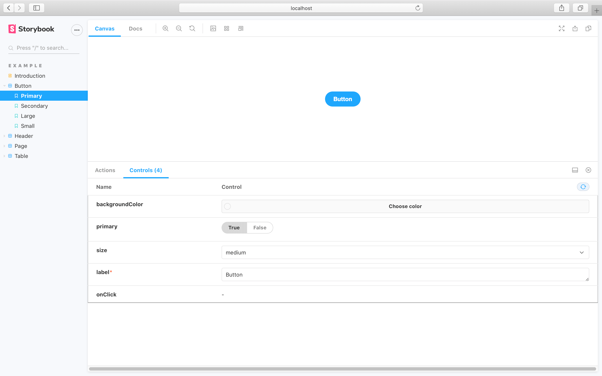

The `layout` [global parameter](../writing-stories/parameters.md) allows you to configure how stories are positioned in Storybook's Canvas tab. 

You can add the parameter to your [`./storybook/preview.js`](./overview.md#configure-story-rendering), like so:

<!-- prettier-ignore-start -->

<CodeSnippets
  paths={[
    'common/storybook-preview-layout-param.js.mdx'
  ]}
/>

<!-- prettier-ignore-end -->

In the example above, Storybook will center all stories in the UI. `layout` accepts these options:

- `centered`: center the component horizontally and vertically in the Canvas
- `fullscreen`: allow the component to expand to the full width and height of the Canvas
- `padded`: Add extra padding around the component

If you want to use your own styles, or require a more granular approach we recommend using [decorators](../writing-stories/decorators.md) instead.
