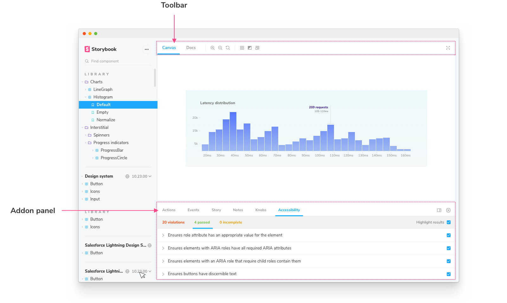

### Features and behavior

To control the layout of Storybook’s UI you can use the `setConfig` addons API in your [`.storybook/manager.js`](overview#configure-story-rendering):

```js
import { addons } from '@storybook/addons';

addons.setConfig({
  isFullscreen: false,
  showNav: true,
  showPanel: true,
  panelPosition: 'bottom',
  sidebarAnimations: true,
  enableShortcuts: true,
  isToolshown: true,
  theme: undefined,
  selectedPanel: undefined,
  initialActive: 'sidebar',
  showRoots: false,
});
```
The following table details how to use the API values:

| Name                  | Type          | Description                                                   | Example Value                                  |
| ----------------------|:-------------:|:-------------------------------------------------------------:|:----------------------------------------------:|
| **isFullscreen**      | Boolean       |Show story component as full screen                            |`false`                                         |
| **showNav**           | Boolean       |Display panel that shows a list of stories                     |`true`                                          |
| **showPanel**         | Boolean       |Display panel that shows addon configurations                  |`true`                                          |
| **panelPosition**     | String/Object |Where to show the addon panel                                  |`bottom` or `{('bottom'|'right')}`              |
| **sidebarAnimations** | Boolean       |Sidebar tree animations                                        |`true`                                          |
| **enableShortcuts**   | Boolean       |Enable/disable shortcuts                                       |`true`                                          |
| **isToolshown**       | String        |Show/hide tool bar                                             |`true`                                          |
| **theme**             | Object        |Storybook Theme, see next section                              |`undefined`                                     |
| **selectedPanel**     | String        |Id to select an addon panel                                    |`my-panel`                                      |
| **initialActive**     | String        |Select the default active tab on Mobile.                       |`'sidebar'` or `{('sidebar'|'canvas'|'addons')}`|
| **showRoots**         | Boolean       |Display the top-level grouping as a "root" in the sidebar      |`false`                                         |

### Theming

Storybook is theme-able using a lightweight theming API.

#### Global theming

It's possible to theme Storybook globally.

Storybook includes two themes that look good out of the box: "normal" (a light theme) and "dark" (a dark theme). Unless you've set your preferred color scheme as dark, Storybook will use the light theme as default.

Make sure you have installed [`@storybook/addons`](https://www.npmjs.com/package/@storybook/addons) and [`@storybook/theming`](https://www.npmjs.com/package/@storybook/theming) packages.

```sh
npm install @storybook/addons --save-dev
npm install @storybook/theming --save-dev
```

As an example, you can tell Storybook to use the "dark" theme by modifying [`.storybook/manager.js`](./overview#configure-story-rendering):

```js
// .storybook/manager.js
import { addons } from '@storybook/addons';
import { themes } from '@storybook/theming';

addons.setConfig({
  theme: themes.dark,
});
```

When setting a theme, set a full theme object. The theme is replaced, not combined.

### Theming docs

[Storybook Docs](../writing-docs) uses the same theme system as Storybook’s UI, but is themed independently from the main UI.

Supposing you have a Storybook theme defined for the main UI in [`.storybook/manager.js`](./overview#configure-story-rendering):

```js
// .storybook/manager.js
import { addons } from '@storybook/addons';
// or a custom theme
import { themes } from '@storybook/theming';

addons.setConfig({
  theme: themes.dark,
});
```

Here's how you'd specify the same theme for docs in [`.storybook/preview.js`](./overview#configure-story-rendering):

```js
// .storybook/preview.js
import { themes } from '@storybook/theming';

// or global addParameters
export const parameters = {
  docs: {
    theme: themes.dark,
  },
};
```

Continue to read if you want to learn how to create your theme.

### Create a theme quickstart

The easiest way to customize Storybook is to generate a new theme using the `create()` function from `storybook/theming`. This function includes shorthands for the most common theme variables. Here's how to use it:

First create a new file in `.storybook` called `yourTheme.js`.

Next paste the code below and tweak the variables.

```js
// yourTheme.js
import { create } from '@storybook/theming/create';

export default create({
  base: 'light',

  colorPrimary: 'hotpink',
  colorSecondary: 'deepskyblue',

  // UI
  appBg: 'white',
  appContentBg: 'silver',
  appBorderColor: 'grey',
  appBorderRadius: 4,

  // Typography
  fontBase: '"Open Sans", sans-serif',
  fontCode: 'monospace',

  // Text colors
  textColor: 'black',
  textInverseColor: 'rgba(255,255,255,0.9)',

  // Toolbar default and active colors
  barTextColor: 'silver',
  barSelectedColor: 'black',
  barBg: 'hotpink',

  // Form colors
  inputBg: 'white',
  inputBorder: 'silver',
  inputTextColor: 'black',
  inputBorderRadius: 4,

  brandTitle: 'My custom storybook',
  brandUrl: 'https://example.com',
  brandImage: 'https://placehold.it/350x150',
});
```

Finally, import your theme into [`.storybook/manager.js`](./overview#configure-story-rendering) and add it to your Storybook parameters.

```js
// .storybook/manager.js
import { addons } from '@storybook/addons';
import yourTheme from './yourTheme';

addons.setConfig({
  theme: yourTheme,
});
```

The `@storybook/theming` package is built using TypeScript, so this should help create a valid theme for TypeScript users. The types are part of the package itself.

Many theme variables are optional, the `base` property is NOT. This is a perfectly valid theme:

```ts
import { create } from '@storybook/theming/create';

export default create({
  base: 'light',
  brandTitle: 'My custom storybook',
  brandUrl: 'https://example.com',
  brandImage: 'https://placehold.it/350x150',
});
```

### CSS escape hatches

The Storybook theme API is narrow by design. If you want to have fine-grained control over the CSS, all of the UI and Docs components are tagged with class names to make this possible. This is advanced usage: **use at your own risk**.

To style these elements, insert style tags into:

- For Storybook’s UI, use `.storybook/manager-head.html`
- For Storybook Docs, use `.storybook/preview-head.html`

<div class="aside">

Similar to changing the preview’s head tag, `.storybook/manager-head.html` allows you to inject code into the manager side, which can be useful to adding styles for your theme that target Storybook’s HTML.

WARNING: we don’t make any guarantees about the structure of Storybook’s HTML and it could change at any time. Consider yourself warned!

</div> 


### MDX component overrides

If you're using MDX for docs, there's one more level of themability. MDX allows you to completely override the components that are rendered from Markdown using a components parameter. This is an advanced usage that we don't officially support in Storybook, but it's a powerful mechanism if you need it.

Here's how you might insert a custom code renderer for `code` blocks on the page, in [`.storybook/preview.js`](./overview#configure-story-rendering):

```js
// .storybook/preview.js
import { CodeBlock } from './CodeBlock';

export const parameters = {
  docs: {
    components: {
      code: CodeBlock,
    },
  },
};
```

You can even override a Storybook block component.

Here's how you might insert a custom `<Preview />` block:

```js
// .storybook/preview.js

import { MyPreview } from './MyPreview';

export const parameters = {
  docs: {
    components: {
      Preview: MyPreview,
    },
  },
};
```

### Addons and theme creation

Some addons require specific theme variables that a Storybook user must add. If you share your theme with the community, make sure to support the official API and other popular addons so your users have a consistent experience.

For example, the popular Actions addon uses [react-inspector](https://github.com/xyc/react-inspector/blob/master/src/styles/themes/chromeLight.js) which has themes of its own. Supply additional theme variables to style it like so:

```js

addonActionsTheme: {
  ...chromeLight,
  BASE_FONT_FAMILY: typography.fonts.mono,
  BASE_BACKGROUND_COLOR: 'transparent',
}
```

### Using the theme for addon authors

Reuse the theme variables above for a native Storybook developer experience. The theming engine relies on [emotion](https://emotion.sh/), a CSS-in-JS library.

```js
import { styled } from '@storybook/theming';
```

Use the theme variables in object notation:

```js
const Component = styled.div(({ theme }) => ({
  background: theme.background.app,
  width: 0,
}));
```

Or with template literals:

```js
const Component = styled.div`
  background: `${props => props.theme.background.app}`
  width: 0;
`;
```

### Storybook addons

A key strength of Storybook is its extensibility. Use addons to extend and customize Storybook to fit your team’s development workflow.

Addons are integral to the way Storybook works. Many of Storybook's core features are implemented as addons! These addons are installed out of the box with [essentials](../essentials). 

#### Addon features

The most obvious thing addons affect in Storybook is the UI of Storybook itself. Within the UI the **toolbar** and **addons panel** are the two chief places addons will appear. 



Addons can also hook into the rendering of your story in the preview pane via injecting their own [decorators](../writing-stories/decorators).

Finally, addons can affect the build setup of Storybook by injecting their own webpack configuration to allow the use of other tools in Storybook. Addons that do only this are often referred to as [presets](../presets/introduction).

### Essential, core and community addons

There are many, many Storybook addons, but they can be roughly categorized into three areas:

- **Essential** addons are core-team developed addons that are considered a part of the out-of-the-box user experience. These ship by default with new Storybook installations.
-  **Core** addons are developed by the core team. They are kept in sync with the development of Storybook itself and written in idiomatic ways as templates for other addons. They can be found within the [Storybook monorepo](https://github.com/storybookjs/storybook/tree/next/addons).

- Community addons are addons written by the massive Storybook community. They can be found on our [website](/addons), [GitHub](https://github.com/), and [npm](https://www.npmjs.com/).

### Sidebar & URLs

Storybook’s sidebar lists all your stories grouped by component. When you have a lot of components you may wish to also group those components also. To do so, you can add the `/` separator to the `title` of your CSF file and Storybook will group the stories into groups based on common prefixes:


We recommend using a nesting scheme that mirrors the filesystem path of the components. For example, if you have a file `components/modals/Alert.js` name the CSF file `components/modals/Alert.stories.js` and title it `Components/Modals/Alert`.

#### Roots

By default, Storybook will treat your highest level of groups as “roots”--which are displayed in the UI as “sections” of the hierarchy. Lower level groups are displayed as expandable items in the hierarchy:


If you’d prefer all groups to be expandable, you can set the `showRoots` option to `false` in  [`./storybook/manager.js`](./overview#configure-story-rendering):

```js
// ./storybook/manager.js

import { addons } from `@storybook/addons`;
addons.setConfig({ showRoots: false });
```

#### Generating titles based on `__dirname`

As a CSF file is a JavaScript file, the exports (including the default export) can be generated dynamically. In particular you can use the `__dirname` variable to generate the title based on the path name (this example uses the paths.macro):

```js
import base from 'paths.macro';
export default {
  title: `${base}/Component`
}
```

#### Permalinking to stories

By default, Storybook generates an `id` for each story based on the component title and the story name. This `id` in particular is used in the URL for each story and that URL can serve as a permalink (especially when you [publish](../workflows/publish-storybook) your Storybook).

Consider the following story:

```js
// your-story.story.js
export default {
  title: 'Foo/Bar',
};

export const Baz = BarStory.bind({});
```

Storybook's ID-generation logic will give this the `id` `foo-bar--baz`, so the link would be `?path=/story/foo-bar--baz`.

It is possible to manually set the id of a story, which in particular is useful if you want to rename stories without breaking permalinks. Suppose you want to change the position in the hierarchy to `OtherFoo/Bar` and the story name to `Moo`. Here's how to do that:

```js
// your-story.story.js

export default {
  title: 'OtherFoo/Bar',
  id: 'Foo/Bar', // or 'foo-bar' if you prefer
};

export const Baz = () => BarStory.bind({});
Baz.storyName = 'Moo';
```

Storybook will prioritize the `id` over the title for ID generation, if provided, and will prioritize the `story.name` over the export key for display.


### Environment variables

You can use environment variables in Storybook to change its behaviour in different “modes”.
If you supply an environment variable prefixed with `STORYBOOK_`, it will be available in `process.env`:

```sh
STORYBOOK_THEME=red STORYBOOK_DATA_KEY=12345 npm run storybook
```

Then we can access these environment variables anywhere inside our preview JavaScript code like below:

```js
console.log(process.env.STORYBOOK_THEME);
console.log(process.env.STORYBOOK_DATA_KEY);
```

You can also access these variables in your custom `<head>`/`<body>` (see below) using the substitution `%STORYBOOK_X%`, for example: `%STORYBOOK_THEME%` will become `red`.

<div class="aside">

If using the environment variables as attributes or values in JavaScript, you may need to add quotes, as the value will be inserted directly. e.g. `<link rel="stylesheet" href="%STORYBOOK_STYLE_URL%" />`

</div>

You can also pass these environment variables when you are [building your Storybook](/basics/exporting-storybook) with `build-storybook`.
Then they'll be hard coded to the static version of your Storybook.
