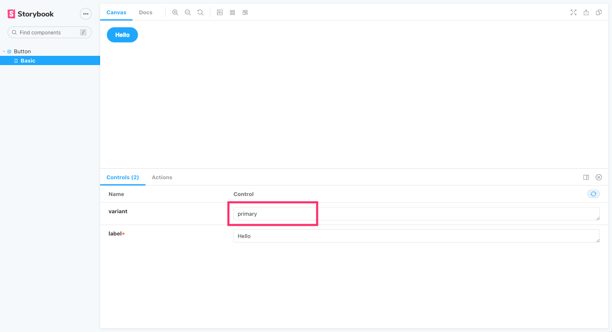
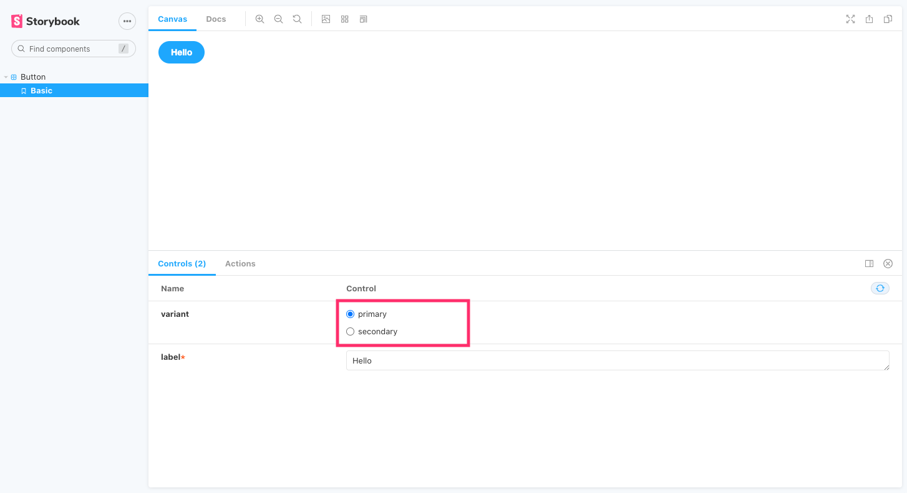
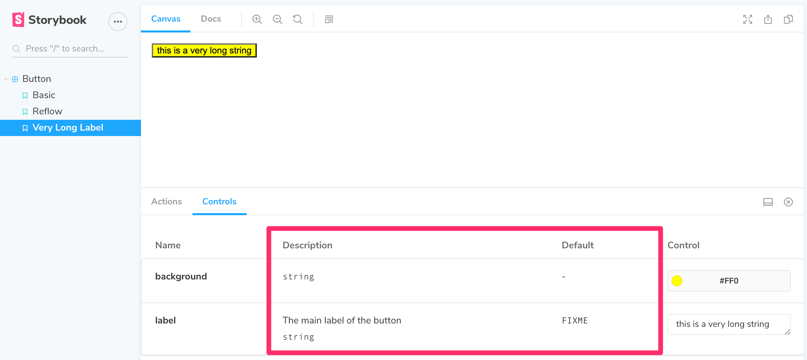

Storybook Controls gives you a graphical UI to interact with a component's arguments dynamically, without needing to code. It creates an addon panel next to your component examples ("stories"), so you can edit them live.

<video autoPlay muted playsInline loop>
  <source
    src="addon-controls-optimized.mp4"
    type="video/mp4"
  />
</video>

Controls does not require any modification to your components. Stories for controls are:

- Convenient. Auto-generate controls based on React/Vue/Angular/etc. components.
- Portable. Reuse your interactive stories in documentation, tests, and even in designs.
- Rich. Customize the controls and interactive data to suit your exact needs.

To use the Controls addon, you need to write your stories using [args](../writing-stories/args.md). Storybook will automatically generate UI controls based on your args and what it can infer about your component; but you can configure the controls further using [argTypes](../api/argtypes.md), see below.

If you have written stories in the older pre-Storybook 6 style, you may want to read the [args & controls migration guide](https://medium.com/storybookjs/storybook-6-migration-guide-200346241bb5) to help understand how to convert your stories for args.

## Choosing the control type

By default, Storybook will choose a control for each arg based on the initial value of the arg. This works well with some kind of args, such as boolean values or free-text strings, but in other cases you want a more restricted control.

<!-- prettier-ignore-start -->

<FeatureSnippets
  paths={[
    'essentials/auto-generated-controls/react.mdx',
    'essentials/auto-generated-controls/vue.mdx',
    'essentials/auto-generated-controls/angular.mdx',
    'essentials/auto-generated-controls/web-components.mdx',
    'essentials/auto-generated-controls/ember.mdx',
    'essentials/auto-generated-controls/fallback.mdx',
  ]}
/>

<!-- prettier-ignore-end -->

For instance, suppose you have a `variant` arg on your story that should be `primary` or `secondary`:

<!-- prettier-ignore-start -->

<CodeSnippets
  paths={[
    'common/button-story-controls-primary-variant.js.mdx',
    'common/button-story-controls-primary-variant.mdx.mdx',
  ]}
/>

<!-- prettier-ignore-end -->

By default, Storybook will render a free text input for the `variant` arg:

This works as long as you type a valid string into the auto-generated text control, but it's not the best UI for our scenario, given that the component only accepts `primary` or `secondary` as variants. Let’s replace it with Storybook’s radio component.

We can specify which controls get used by declaring a custom [argType](../api/argtypes.md) for the `variant` property. ArgTypes encode basic metadata for args, such as name, description, defaultValue for an arg. These get automatically filled in by Storybook Docs.

ArgTypes can also contain arbitrary annotations which can be overridden by the user. Since `variant` is a property of the component, let's put that annotation on the default export.

<!-- prettier-ignore-start -->

<CodeSnippets
  paths={[
    'common/button-story-controls-radio-group.js.mdx',
    'common/button-story-controls-radio-group.mdx.mdx',
  ]}
/>

<!-- prettier-ignore-end -->

This replaces the input with a radio group for a more intuitive experience.

## Custom control type matchers

For a few types, Controls will automatically infer them by using [regex](https://developer.mozilla.org/docs/Web/JavaScript/Reference/Global_Objects/RegExp). You can change the matchers for a regex that suits you better.

| Data type |       Default regex       |                        Description                        |
| :-------: | :-----------------------: | :-------------------------------------------------------: |
| **color** | `/(background\|color)$/i` | Will display a color picker UI for the args that match it |
| **date**  |         `/Date$/`         | Will display a date picker UI for the args that match it  |

To do so, use the `matchers` property in `controls` parameter:

<!-- prettier-ignore-start -->

<CodeSnippets
  paths={[
    'common/storybook-addon-controls-custom-matchers.js.mdx',
  ]}
/>

<!-- prettier-ignore-end -->

## Fully custom args

Up until now, we only used auto-generated controls based on the component we're writing stories for. If we are writing [complex stories](../workflows/stories-for-multiple-components.md) we may want to add controls for args that aren’t part of the component.

<!-- prettier-ignore-start -->

<CodeSnippets
  paths={[
    'react/table-story-fully-customize-controls.js.mdx',
    'react/table-story-fully-customize-controls.mdx.mdx',
    'vue/table-story-fully-customize-controls.2.js.mdx',
    'vue/table-story-fully-customize-controls.3.js.mdx',
    'angular/table-story-fully-customize-controls.ts.mdx',
  ]}
/>

<!-- prettier-ignore-end -->

By default, Storybook will add controls for all args that:

- It infers from the component definition [if your framework supports it](../api/frameworks-feature-support.md).

- Appear in the list of args for your story.

Using `argTypes`, you can change the display and behavior of each control.

### Dealing with complex values

You'll notice when dealing with non-primitive values, you'll run into some limitations. The most obvious issue is that not every value can be represented as part of the `args` param in the URL, losing the ability to share and deeplink to such a state. Beyond that, complex values such as JSX cannot be synchronized between the manager (e.g. Controls addon) and the preview (your story).

One way to deal with this is to use primitive values (e.g. strings) as arg values, and using a story template to convert these values to their complex counterpart before rendering. This isn't the nicest way to do it (see below), but certainly the most flexible.

<!-- prettier-ignore-start -->

<CodeSnippets
  paths={[
    'react/component-story-custom-args-complex.js.mdx',
    'react/component-story-custom-args-complex.ts.mdx',
    'react/component-story-custom-args-complex.mdx.mdx',
    'vue/component-story-custom-args-complex.2.js.mdx',
    'vue/component-story-custom-args-complex.3.js.mdx',
    'angular/component-story-custom-args-complex.ts.mdx',
  ]}
/>

<!-- prettier-ignore-end -->

Unless you need the flexibility of a function, an easier way to map primitives to complex values before rendering is to define a `mapping`. Additionally, you can specify `control.labels` to configure custom labels for your checkbox, radio or select input.

<!-- prettier-ignore-start -->

<CodeSnippets
  paths={[
    'common/component-story-custom-args-mapping.js.mdx',
  ]}
/>

<!-- prettier-ignore-end -->

Note that both `mapping` and `control.labels` don't have to be exhaustive. If the currently selected option is not listed, it will be used verbatim.

## Configuration

The Controls addon can be configured in two ways:

- Individual controls can be configured via control annotations.
- The addon's appearance can be configured via parameters.

### Annotation

As shown above, you can configure individual controls with the “control" annotation in the [argTypes](../api/argtypes) field of either a component or story.

Here is the full list of available controls you can use:

| Data Type   | Control Type | Description                                              |    Options     |
| :---------- | :----------: | :------------------------------------------------------- | :------------: |
| **boolean** |   boolean    | checkbox input                                           |       -        |
| **number**  |    number    | a numeric text box input                                 | min, max, step |
|             |    range     | a range slider input                                     | min, max, step |
| **object**  |    object    | json editor text input                                   |       -        |
| **array**   |    object    | json editor text input                                   |       -        |
|             |     file     | a file input that gives you a array of urls              |     accept     |
| **enum**    |    radio     | radio buttons input                                      |       -        |
|             | inline-radio | inline radio buttons input                               |       -        |
|             |    check     | multi-select checkbox input                              |       -        |
|             | inline-check | multi-select inline checkbox input                       |       -        |
|             |    select    | select dropdown input                                    |       -        |
|             | multi-select | multi-select dropdown input                              |       -        |
| **string**  |     text     | simple text input                                        |       -        |
|             |    color     | color picker input that assumes strings are color values |       -        |
|             |     date     | date picker input                                        |       -        |

If you need to customize a control for a number data type in your story, you can do it like so:

<!-- prettier-ignore-start -->

<CodeSnippets
  paths={[
    'common/gizmo-story-controls-customization.js.mdx',
    'common/gizmo-story-controls-customization.mdx.mdx',
  ]}
/>

<!-- prettier-ignore-end -->

If you don't provide a specific one, it defaults to the number control type.

### Parameters

Controls supports the following configuration [parameters](../writing-stories/parameters.md), either globally or on a per-story basis:

## Show full documentation for each property

Since Controls is built on the same engine as Storybook Docs, it can also show property documentation alongside your controls using the expanded parameter (defaults to false). This means you embed a complete [ArgsTable](../writing-docs/doc-blocks.md#argstable) doc block in the controls pane. The description and default value rendering can be [customized](#fully-custom-args) in the same way as the doc block.

To enable expanded mode globally, add the following to [`.storybook/preview.js`](../configure/overview.md#configure-story-rendering):

<!-- prettier-ignore-start -->

<CodeSnippets
  paths={[
    'common/storybook-preview-expanded-controls.js.mdx',
    ]}
/>

<!-- prettier-ignore-end -->

And here's what the resulting UI looks like:

### Disable controls for specific properties

Aside from the features already documented here, Controls can also be disabled for individual properties.

Suppose you want to disable Controls for a property called `foo` in a component's story. The following example illustrates how:

<!-- prettier-ignore-start -->

<CodeSnippets
  paths={[
    'common/component-story-disable-controls.js.mdx',
    'common/component-story-disable-controls.mdx.mdx'
  ]}
/>

<!-- prettier-ignore-end -->

Resulting in the following change in Storybook UI:

<video autoPlay muted playsInline loop>
  <source
    src="addon-controls-disable-specific-prop.mp4"
    type="video/mp4"
  />
</video>

The previous example also removed the prop documentation from the table. In some cases this is fine, however sometimes you might want to still render the prop documentation but without a control. The following example illustrates how:

<CodeSnippets
paths={[
'common/component-story-disable-controls-alt.js.mdx',
'common/component-story-disable-controls-alt.mdx.mdx'
]}
/>

As with other Storybook properties, such as [decorators](../writing-stories/decorators.md) the same principle can also be applied at a story-level for more granular cases.

## Hide NoControls warning

If you don't plan to handle the control args inside your Story, you can remove the warning with:

<!-- prettier-ignore-start -->

<CodeSnippets
  paths={[
    'common/button-story-hide-nocontrols-warning.js.mdx',
  ]}
/>

<!-- prettier-ignore-end -->

## Filtering controls

In some cases, you may want to either only present a few controls in the controls panel, or present all controls except a small set.

To make this possible, you can use optional `include` and `exclude` configuration fields in the `controls` parameter, which can be set to either an array of strings, or a regular expression.

Consider the following story snippets:

<!-- prettier-ignore-start -->

<CodeSnippets
  paths={[
    'common/component-story-disable-controls-regex.js.mdx',
    'common/component-story-disable-controls-regex.mdx.mdx'
  ]}
/>

<!-- prettier-ignore-end -->

## Sorting controls

By default, controls are unsorted and use whatever order the args data is processed in (`none`). It can also be configured to sort alphabetically by arg name (`alpha`) or alphabetically required args first (`requiredFirst`).

Consider the following snippet to force required args first:

<!-- prettier-ignore-start -->

<CodeSnippets
  paths={[
    'common/component-story-sort-controls.js.mdx',
    'common/component-story-sort-controls.mdx.mdx'
  ]}
/>

<!-- prettier-ignore-end -->
