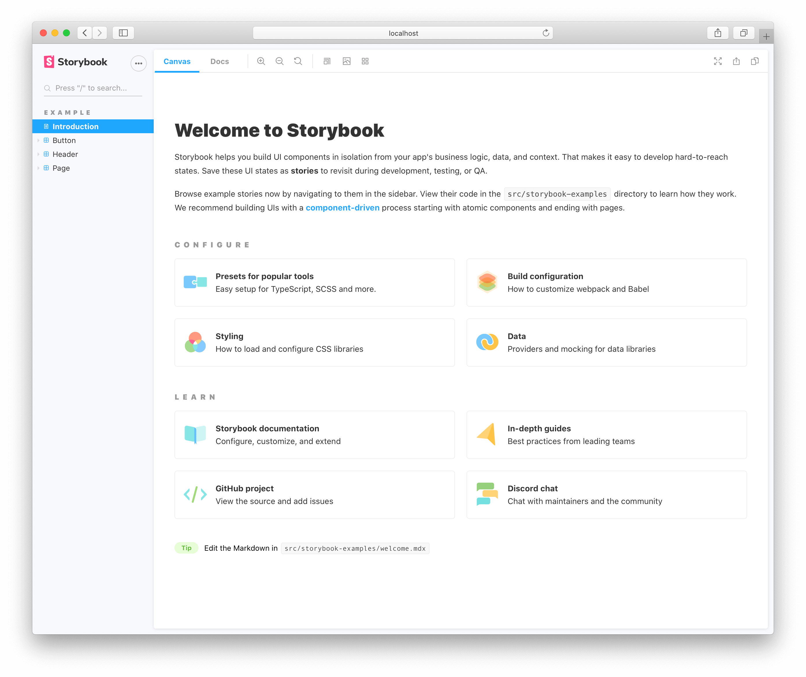

Use the Storybook CLI to install it in a single command. Run this inside your existing project’s root directory:

<!-- prettier-ignore-start -->

<CodeSnippets
  paths={[
    'common/storybook-install.sh.mdx',
  ]}
/>

<!-- prettier-ignore-end -->

<code>sb init</code> is not made for empty projects

Storybook needs to be installed into a project that is already setup with a framework. It will not work on an empty project. There are many ways to bootstrap an app in given framework including:

- 📦 [Create React App](https://reactjs.org/docs/create-a-new-react-app.html)
- 📦 [Vue CLI](https://cli.vuejs.org/)
- Or any other tooling available.

During its install process, Storybook will look into your project's dependencies and provide you with the best configuration available.

The command above will make the following changes to your local environment:

- 📦 Install the required dependencies.
- 🛠 Setup the necessary scripts to run and build Storybook.
- 🛠 Add the default Storybook configuration.
- 📝 Add some boilerplate stories to get you started.

Check that everything worked by running:

<!-- prettier-ignore-start -->

<CodeSnippets
  paths={[
    'common/storybook-execute.sh.mdx',
  ]}
/>

<!-- prettier-ignore-end -->

It will start Storybook locally and output the address. Depending on your system configuration, it will automatically open the address in a new browser tab and you'll be greeted by a welcome screen. In that screen there are some noteworthy items:

- A collection of useful links for more in depth configuration and customization options you have at your disposal.
- A second set of links for you to expand your Storybook knowledge and get involved with the ever growing Storybook community.
- A few example stories to get you started.

Troubleshooting

You can also setup Storybook manually through the Storybook CLI.

You can use the `--type` flag to tell Storybook to configure itself based on the flag.

For instance you can use:

- `--type react` to setup Storybook with the React configuration options.
- `--type vue` to setup Storybook with the Vue configuration options.
- `--type angular` to setup Storybook with the Angular configuration options.

If there's an installation problem, check the README for your framework (e.g <a href="https://github.com/storybookjs/storybook/blob/next/app/react/README.md">Storybook for React</a>).

If all else fails, try asking for [help](https://storybook.js.org/support/)

Now that you installed Storybook successfully, let’s take a look at a story that was written for us.
