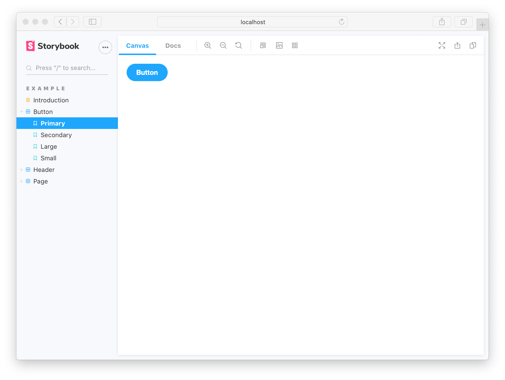

A story captures the rendered state of a UI component. Developers write multiple stories per component that describe all the “interesting” states a component can support.

The CLI created example components that demonstrate the types of components you can build with Storybook: Button, Header, and Page.

Each example component has a set of stories that show the states it supports. You can browse the stories in the UI and see the code behind them in files that end with `.stories.js` or `.stories.ts`. The stories are written in Component Story Format (CSF)--an ES6 modules-based standard--for writing component examples.

Let’s start with the `Button` component. A story is a function that describes how to render the component in question. Here’s how to render `Button` in the “primary” state and export a story called `Primary`.

<!-- prettier-ignore-start -->

<CodeSnippets
  paths={[
    'react/button-story.js.mdx',
    'react/button-story.ts.mdx',
    'react/button-story.mdx.mdx',
  ]}
/>

<!-- prettier-ignore-end -->



View the rendered `Button` by clicking on it in the Storybook sidebar.

The above story definition can be further improved to take advantage of [Storybook’s “args”](../writing-stories/args.md) concept. Args describes the arguments to Button in a machine readable way. This unlocks Storybook’s superpower of altering and composing arguments dynamically.

```js
// We create a “template” of how args map to rendering

const Template = (args) => <Button {...args} />;

// Each story then reuses that template
export const Primary = Template.bind({});

Primary.args = {
  primary: true,
  label: 'Button',
};
```


Both story examples render the same thing because Storybook feeds the given `args` property into the story during render. But you get timesaving conveniences with args:

- `Button`s callbacks are logged into the Actions tab. Click to try it.
- `Button`s arguments are dynamically editable in the Controls tab. Adjust the controls

<div class="aside">

Note that `Template.bind({})` is a [standard JavaScript](https://developer.mozilla.org/en-US/docs/Web/JavaScript/Reference/Global_Objects/Function/bind) technique for making a copy of a function. We copy the `Template` so each exported story can set its own properties on it.

</div>

### Edit a story

Storybook makes it easy to work on one component in one state (aka a story) at a time. When you edit the Button code or stories, Storybook will instantly re-render in the browser. No need to manually refresh.

Update the `label` of the `Primary` story then see your change in Storybook.

<video autoPlay muted playsInline loop>
  <source
    src="example-button-hot-module-reload-optimized.mp4"
    type="video/mp4"
  />
</video>

Stories are also useful for checking that UI continues to look correct as you make changes. The `Button` component has four stories that show it in different use cases. View those stories now to confirm that your change to `Primary` didn’t introduce unintentional bugs in the other stories.

<video autoPlay muted playsInline loop>
  <source
    src="example-button-browse-stories-optimized.mp4"
    type="video/mp4"
  />
</video>

Checking a component’s stories as you develop helps prevent accidental regressions. Tools that integrate with Storybook can also [automate](../workflows/testing-with-storybook.md) this for you.

Now we’ve seen the basic anatomy of a story, let’s see how we use Storybook’s UI to develop stories.
