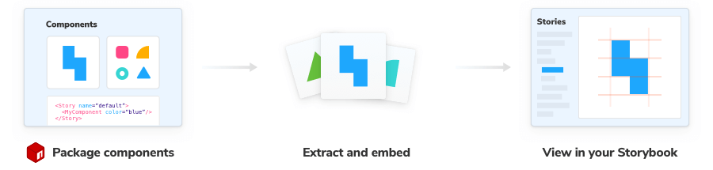
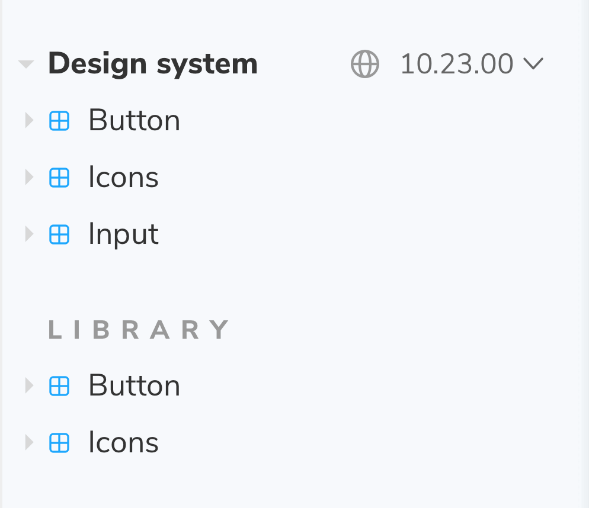

Storybook is widely used by component libraries and design systems. Design system authors can automatically compose their design systems inside their consumer’s Storybooks.

For example, if you use a design system package, its stories can appear alongside your own. That makes it convenient to cross reference usage documentation without leaving Storybook.

## For package consumers

Composition happens automatically if the package [supports](#for-package-authors) it. When you install the package, Storybook will load its stories alongside your own.



### Configuring

If you want to configure how the composed Storybook behaves, you can disable the `ref` element in your [`.storybook/main.js`](../configure/overview.md#configure-story-rendering)

<!-- prettier-ignore-start -->

<CodeSnippets
  paths={[
    'common/storybook-main-disable-refs.js.mdx',
  ]}
/>

<!-- prettier-ignore-end -->

### Changing versions

Change the version of the composed Storybook to see how the library evolves. This requires [configuration](#providing-a-version-section) from the package author.



## For package authors

Component library authors can expand adoption by composing their components in their consumer’s Storybooks.

Add a `storybook` property in your published `package.json`that contains an object with a `url` field. Point the URL field to a published Storybook at the version you want.

```json
// Your component library’s package.json
{
  "storybook": {
    "url": "https://host.com/your-storybook-for-this-version"
  }
}
```

### Automatic version selection

If you are using a [CHP level 1 service](#chp-level-1) for hosting (such as [Chromatic.com](https://www.chromatic.com/)), you can provide a single URL for your Storybook in the `storybook.url` field. You do not need to change the URL each time you publish a new version. Storybook will automatically find the correct URL for your package.

For example, for Chromatic, you might do:

```json
{
  "storybook": {
    "url": "https://master--xyz123.chromatic.com"
  }
}
```

In this example `xyz123` is your project’s id. Storybook will automatically compose in the Storybook published to that project corresponding to the version the user has installed.

### Providing a version section

Similarly, if you're using a [CHP level 1 service](#chp-level-1) (such as chromatic.com) for hosting, you can provide a list of versions for the user to [choose from](#changing-versions) to experiment with other versions of your package.

## Component Hosting Protocol (CHP)

Storybook can communicate with services that host built Storybooks online. This enables features such as [Composition](./storybook-composition). We categorize services via compliance with the "Component Hosting Protocol" (CHP) with various levels of support in Storybook.

### CHP level 1

The service serves uploaded Storybooks and makes the following available:

- Versioned endpoints, URLs that resolve to different published Storybooks depending on a `version=x.y.z` query parameter (where `x.y.z` is the released version of the package).
- Support for `/stories.json`
- Support for `/metadata.json` and the `releases` field.

Examples of such services: [chromatic.com](https://www.chromatic.com/).

### CHP level 0

The service can serve uploaded Storybooks. There is no special integration with Storybook APIs.

Examples of such services: [Netlify](https://www.netlify.com/) and [S3](https://aws.amazon.com/en/s3/).
