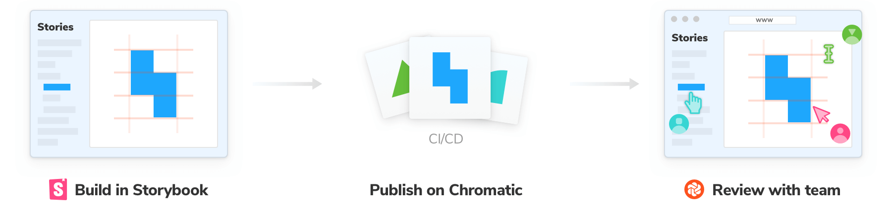
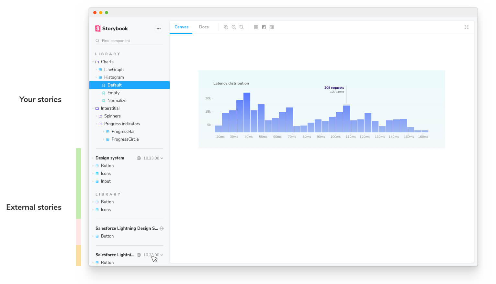

Storybook is more than a UI component development tool. Teams also publish Storybook online to review and collaborate on works in progress. That allows developers, designers, and PMs to check if UI looks right without touching code or needing a local dev environment.

## Build Storybook as a static web application

First, we’ll need to build Storybook as a static web application using `build-storybook`, a command that’s installed by default.

```shell
yarn build-storybook -o ./path/to/build
```

Storybook will create a static web application at the path you specify. This can be served by any web server. Try it out locally by running:

```shell
npx http-server ./path/to/build
```

<details>
    <summary><h4>Troubleshooting routing issues with Storybook 6.0</h4></summary>

    After you've built your Storybook following the instructions outlined above, you encounter an issue where you cannot change the route in the sidebar, try building your Storybook with the `--no-dll` flag and see if it solves the problem. If so adjust your `build-storybook` script accordingly to include this flag. Be advised that the build process will run slower than usual.
</details>

<div class="aside">

Asides from the `-o` flag, you can also include other flags to build Storybook, for instance if you're using [Docs](../writing-docs/introduction.md), you can append the `--docs` flag and Storybook will build your [MDX](../writing-docs/mdx.md) and [CSF](../writing-stories/introduction.md#component-story-format) stories into a rich and interactive documentation.

You can learn more about these flag options [here](../api/cli-options.md).

</div>

## Publish Storybook online

Once your Storybook is built as a static web app it can be deployed to any static site hosting services. The Storybook team uses [Chromatic](https://www.chromatic.com/), a free publishing service made by Storybook maintainers that documents, versions, and indexes your UI components securely in the cloud.

We also maintain [`storybook-deployer`](https://github.com/storybookjs/storybook-deployer) to deploy to GitHub pages or AWS S3.

<video autoPlay muted playsInline loop>
  <source
    src="storybook-publish-review-optimized.mp4"
    type="video/mp4"
  />
</video>

## Review with your team

Publishing Storybook as part of the development process makes it quick and easy to [gather team feedback](https://www.learnstorybook.com/design-systems-for-developers/react/en/review/).

A common method to ask for review is to paste a link to the published Storybook in a pull request or Slack.

If you publish your Storybook to Chromatic, you can use the [UI Review](https://www.chromatic.com/features/publish) feature to automatically scan your PRs for new and updated stories. That makes it easy to identify what changed and give feedback.



## Reference external Storybooks

Storybook allows you to browse components from any [Storybook published online](./storybook-composition.md) inside your local Storybook. It unlocks common workflows that teams often struggle with:

- 👩‍💻 UI developers can quickly reference prior art without switching between Storybooks.
- 🎨 Design systems can expand adoption by composing themselves into their users’ Storybooks.
- 🛠 Frontend platform can audit how components are used across projects.



Toggle between multiple versions of Storybook to see how components change between versions. This is useful for design system package authors who maintain many versions at once.

**Requires** a [CHP level 1](./package-composition.md#chp-level-1) server (such as [chromatic.com](https://www.chromatic.com/)),
