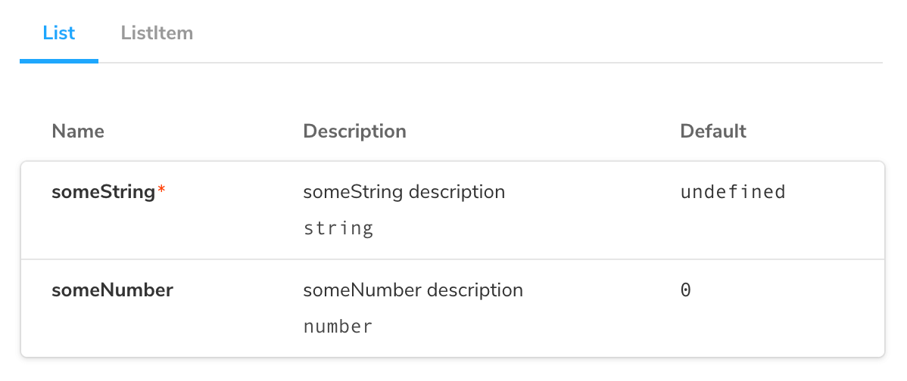

It's useful to write stories that [render two or more components](../writing-stories/introduction.md#stories-for-two-or-more-components) at once if those components are designed to work together. For example, `ButtonGroups`, `Lists`, and `Page` components. Here's an example with `List` and `ListItem` components:

<!-- prettier-ignore-start -->

<CodeSnippets
  paths={[
    'react/list-story-with-subcomponents.js.mdx',
    'react/list-story-with-subcomponents.ts.mdx',
  ]}
/>

<!-- prettier-ignore-end -->

Note that by adding `subcomponents` to the default export, we get an extra pane on the ArgsTable, listing the props of `ListItem`:

The downside of the approach used above, where each story creates its own combination of components, is that it does not take advantage of Storybook [Args](../writing-stories/args.md) meaning:

1. You cannot change the stories via the controls panel
2. There is no [args reuse](../writing-stories/introduction.md#using-args) possible, which makes the stories harder to maintain.

Let's talk about some techniques you can use to mitigate the above, which are especially useful in more complicated situations.

## Reusing subcomponent stories

The simplest change we can make to the above is to reuse the stories of the `ListItem` in the `List`:

<!-- prettier-ignore-start -->

<CodeSnippets
  paths={[
    'react/list-story-unchecked.js.mdx',
    'react/list-story-unchecked.ts.mdx',
  ]}
/>

<!-- prettier-ignore-end -->

By rendering the `Unchecked` story with its args, we are able to reuse the input data from the `ListItem` stories in the `List`.

However, we still aren’t using args to control the `ListItem` stories, which means we cannot change them with controls and we cannot reuse them in other, more complex component stories.

## Using children as an arg

One way we improve that situation is by pulling the rendered subcomponent out into a `children` arg:

<!-- prettier-ignore-start -->

<CodeSnippets
  paths={[
    'react/list-story-with-unchecked-children.js.mdx',
  ]}
/>

<!-- prettier-ignore-end -->

Now that `children` is an arg, we can potentially reuse it in another story.

As things stand (we hope to improve this soon) you cannot edit children in a control yet.

## Creating a Template Component

Another option that is more “data”-based is to create a special “story-generating” template component:

<!-- prettier-ignore-start -->

<CodeSnippets
  paths={[
    'react/list-story-template.js.mdx',
    'react/list-story-template.ts.mdx'
  ]}
/>

<!-- prettier-ignore-end -->

This approach is a little more complex to setup, but it means you can more easily reuse the `args` to each story in a composite component. It also means that you can alter the args to the component with the Controls addon:

<video autoPlay muted playsInline loop>
  <source
    src="template-component-with-controls-optimized.mp4"
    type="video/mp4"
  />
</video>
