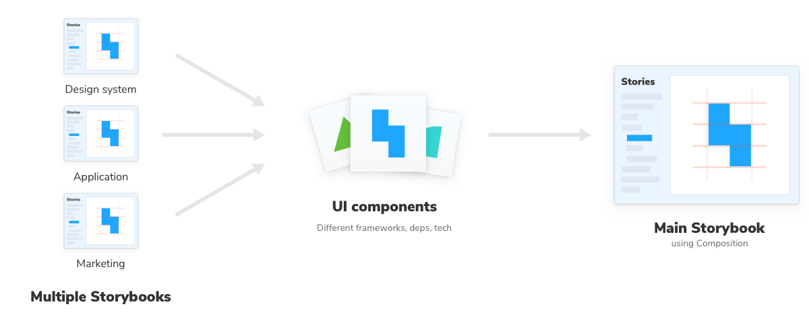

Composition allows you to embed components from any Storybook inside your local Storybook. It’s made for teams who adopt Storybook in multiple projects but can’t ensure that the projects have the same tech stack or share the same repo.

You can compose any Storybook [published online](./publish-storybook.md) or running locally no matter the view layer, tech stack, or dependencies.



## Compose published Storybooks

In your [`storybook/main.js`](../configure/overview.md#configure-story-rendering) file add a `refs` field with information about the reference Storybook. Pass in a URL to a statically built Storybook.

<!-- prettier-ignore-start -->

<CodeSnippets
  paths={[
    'common/storybook-main-ref-remote.js.mdx',
  ]}
/>

<!-- prettier-ignore-end -->

<div class="aside">
 We would like to point out that there's some limitations to composition. For now addons in composed Storybooks will not work as they do in non composed Storybooks. 
</div>

## Compose local Storybooks

You can also compose Storybook that are running locally. For instance, if you have a React Storybook and a Angular Storybook running on different ports:

<!-- prettier-ignore-start -->

<CodeSnippets
  paths={[
    'common/storybook-main-ref-local.js.mdx',
  ]}
/>

<!-- prettier-ignore-end -->

This composes the React and Angular Storybooks into your current Storybook. When either code base changes, hot-module-reload will work perfectly. That enables you to develop both frameworks in sync.

### Improve your Storybook composition

So far we've covered how we can use composition with local or published Storybooks. One thing worth mentioning as your Storybook will grow in time with your own stories, or through composition with other Storybooks, is that you can optimize the deployment process by including the following command in your workflow:

```shell
npx sb extract
```

Using this command will generate a `stories.json` file in the default build directory (`storybook-static`) with information regarding your Storybook. Here's how it might look:

<!-- prettier-ignore-start -->

<CodeSnippets
  paths={[
    'common/storybook-extract-result.json.mdx',
  ]}
/>

<!-- prettier-ignore-end -->

Once you add a reference to a Storybook deployed using this method, almost immediately you'll see all the stories and other relevant information displayed in the UI.

If required, you can also add additional arguments to this command. You can use the following to generate the `stories.json` file to a custom directory:

```shell
npx sb extract my-built-storybook-directory my-other-directory
```

Once the command executes it will look for a built Storybook in the `my-built-storybook-directory` and create the file in `my-other-directory`.

<div class="aside">

If you need to use arguments, you'll need to use both of them, or the command will not be executed properly.

</div>


 