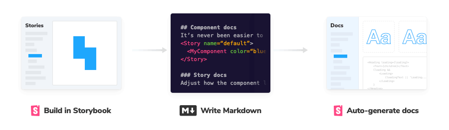
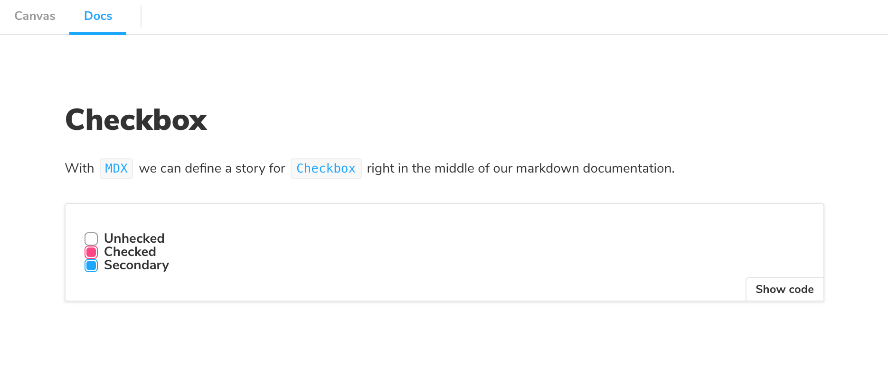
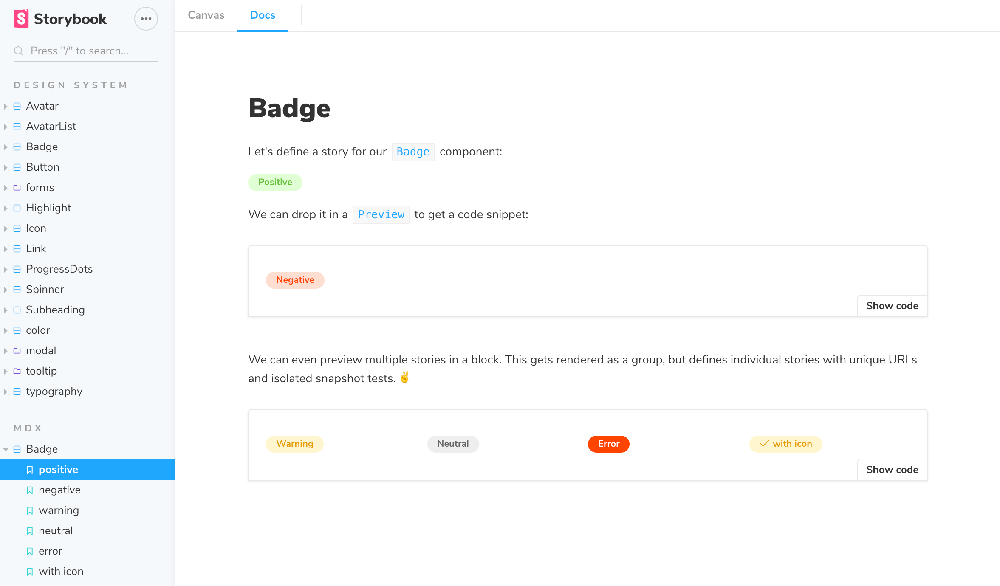
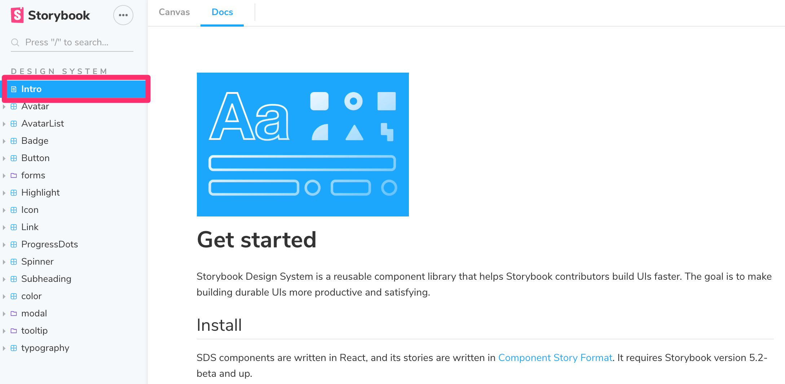

MDX is a [standard file format](https://mdxjs.com/) that combines Markdown with JSX. This means you can use Markdown’s terse syntax (such as # heading) for your documentation, write stories that compile to our component story format, and freely embed JSX component blocks at any point in the file. All at once.

In addition, you can write pure documentation pages in MDX and add them to Storybook alongside your stories.

## Basic example

Let's get started with an example that combines Markdown with a single story:

<!-- prettier-ignore-start -->

<CodeSnippets
  paths={[
    'common/checkbox-story.mdx.mdx',
  ]}
/>

<!-- prettier-ignore-end -->

And here's how that's rendered in Storybook:

As you can see there's a lot going on here. We're writing Markdown, we're writing JSX, and we're also defining Storybook stories that are drop-in compatible with the entire Storybook ecosystem.

Let's break it down.

## MDX-flavored CSF

MDX-flavored [Component Story Format (CSF)](../api/csf.md) includes a collection of components called ["Doc Blocks"](./doc-blocks.md), that allow Storybook to translate MDX files into Storybook stories. MDX-defined stories are identical to regular Storybook stories, so they can be used with Storybook's entire ecosystem of addons and view layers.

For example, here's the first story from the Checkbox example above, rewritten in CSF:

<!-- prettier-ignore-start -->

<CodeSnippets
  paths={[
    'common/checkbox-story-csf.js.mdx',
  ]}
/>

<!-- prettier-ignore-end -->

There's a one-to-one mapping from the code in MDX to CSF. As a user, this means your existing Storybook knowledge should translate between the two.

## Writing stories

Let's look at a more realistic example to see how MDX works:

<!-- prettier-ignore-start -->

<CodeSnippets
  paths={[
    'common/badge-story.mdx.mdx',
  ]}
/>

<!-- prettier-ignore-end -->

And here's how that gets rendered in Storybook:

## Embedding stories

Suppose you have an existing story and want to embed it into your docs. Here's how to show a story with ID some--id. Check the browser URL in Storybook v5+ to find a story's ID.

<!-- prettier-ignore-start -->

<CodeSnippets
  paths={[
    'common/component-story-mdx-embed.mdx.mdx',
  ]}
/>

<!-- prettier-ignore-end -->

You can also use the rest of the MDX features in conjunction with embedding. That includes source, preview, and prop tables.

## Decorators and parameters

To add decorators and parameters in MDX:

<!-- prettier-ignore-start -->

<CodeSnippets
  paths={[
    'common/component-story-mdx-decorators-params.mdx.mdx',
  ]}
/>

<!-- prettier-ignore-end -->

Global parameters and decorators work just like before.

## Documentation-only MDX

Typically, when you use Storybook MDX, you define stories in the MDX and documentation is automatically associated with those stories. But what if you want to write Markdown-style documentation without any stories inside?

If you don't define stories in your MDX, you can write MDX documentation and associate it with an existing story, or embed that MDX as its own documentation node in your Storybook's navigation.

If you don't define a Meta, you can write Markdown and associate with an existing story. See ["CSF Stories with MDX Docs"](../../addons/docs/docs/recipes.md#csf-stories-with-mdx-docs).

To get a "documentation-only story", in your UI, define a `<Meta>` as you normally would, but don't define any stories. It will show up in your UI as a documentation node:

## MDX file names

Unless you use a custom [webpack configuration](../configure/webpack.md#extending-storybooks-webpack-config), all of your MDX files should have the suffix `*.stories.mdx`. This tells Storybook to apply its special processing to the `<Meta>` and `<Story>` elements in the file.

Be sure to update [.storybook/main.js](../configure/overview.md#configure-story-rendering) file to load `.stories.mdx` stories, as per the addon-docs installation instructions.

