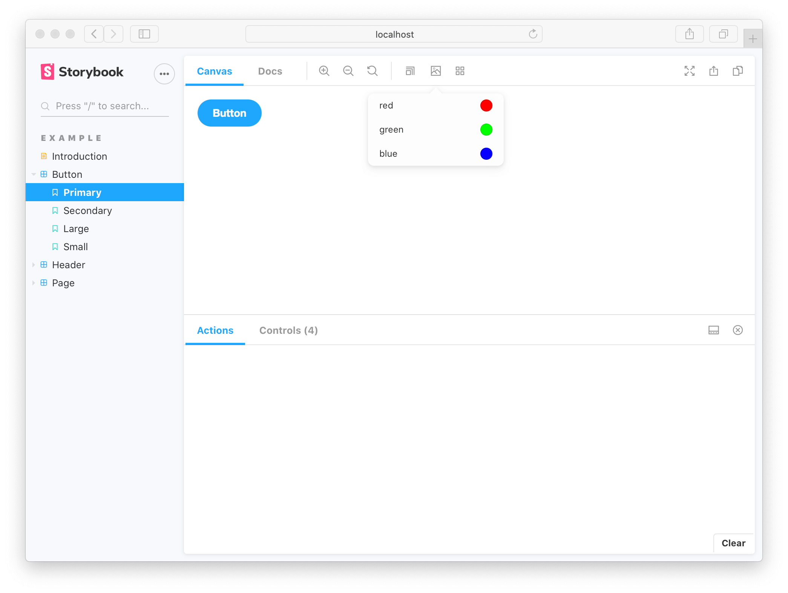

A story captures the rendered state of a UI component. It’s a function that returns a component’s state given a set of arguments.

Storybook uses the generic term arguments (args for short) when talking about React’s `props`, Vue’s `slots`, Angular’s `@input`, and other similar concepts.

## Where to put stories

A component’s stories are defined in a story file that lives alongside the component file. The story file is for development-only, it won't be included in your production bundle.

```
Button.js | ts
Button.stories.js | ts
```

## Component Story Format

We define stories according to the [Component Story Format](../api/csf.md) (CSF), an ES6 module-based standard that is easy to write and portable between tools.

The key ingredients are the [default export](https://developer.mozilla.org/en-US/docs/Web/JavaScript/Reference/Statements/export#Using_the_default_export) that describes the component, and [named exports](https://developer.mozilla.org/en-US/docs/Web/JavaScript/Reference/Statements/export#Using_named_exports) that describe the stories.

### Default export

The _default_ export metadata controls how Storybook lists your stories and provides information used by addons. For example, here’s the default export for a story file `Button.stories.js`:

<!-- prettier-ignore-start -->

<CodeSnippets
  paths={[
    'react/button-story-default-export-with-component.js.mdx',
    'react/button-story-default-export-with-component.ts.mdx',
    'vue/button-story-default-export-with-component.js.mdx',
    'angular/button-story-default-export-with-component.ts.mdx',
  ]}
/>

<!-- prettier-ignore-end -->

### Defining stories

Use the _named_ exports of a CSF file to define your component’s stories. We recommend you use UpperCamelCase for your story exports. Here’s how to render `Button` in the “primary” state and export a story called `Primary`.

<!-- prettier-ignore-start -->

<CodeSnippets
  paths={[
    'react/button-story.js.mdx',
    'react/button-story.ts.mdx',
    'vue/button-story.js.mdx',
    'angular/button-story.ts.mdx',
  ]}
/>

<!-- prettier-ignore-end -->

### Rename stories

You can rename any particular story you need. For instance to give it a more clearer name. Here's how you can change the name of the `Primary` story:

<!-- prettier-ignore-start -->

<CodeSnippets
  paths={[
    'react/button-story-rename-story.js.mdx',
    'react/button-story-rename-story.ts.mdx',
    'vue/button-story-rename-story.js.mdx',
    'angular/button-story-rename-story.ts.mdx',
  ]}
/>

<!-- prettier-ignore-end -->

Your story will now be shown in the sidebar with the given text.

## How to write stories

A story is a function that describes how to render a component. You can have multiple stories per component. The simplest way to create stories is to render a component with different arguments multiple times.

<!-- prettier-ignore-start -->

<CodeSnippets
  paths={[
    'react/button-story-with-emojis.js.mdx',
    'react/button-story-with-emojis.ts.mdx',
    'vue/button-story-with-emojis.js.mdx',
    'angular/button-story-with-emojis.ts.mdx',
  ]}
/>

<!-- prettier-ignore-end -->

This is straightforward for components with few stories, but can be repetitive with many stories.

### Using args

Refine this pattern by defining a master template for a component’s stories that allows you to pass in `args`. This reduces the unique code you’ll need to write and maintain for each story.

<!-- prettier-ignore-start -->

<CodeSnippets
  paths={[
    'react/button-story-using-args.js.mdx',
    'react/button-story-using-args.ts.mdx',
    'vue/button-story-using-args.js.mdx',
    'angular/button-story-using-args.ts.mdx',
  ]}
/>

<!-- prettier-ignore-end -->

The template is reused across stories. Template.bind({}) makes a copy of the function which reduces code duplication. Similarly,`...Primary.args` makes a copy of the data, reducing data duplication.

What’s more, you can import args to reuse when writing stories for other components. This is useful when you’re building composite components. For example, if we make a `ButtonGroup` story, we might remix two stories from its child component `Button`.

<!-- prettier-ignore-start -->

<CodeSnippets
  paths={[
    'react/button-group-story.js.mdx',
    'react/button-group-story.ts.mdx',
    'angular/button-group-story.ts.mdx',
  ]}
/>

<!-- prettier-ignore-end -->

When Button’s signature changes, you only need to change Button’s stories to reflect the new schema. ButtonGroup’s stories will automatically be updated. This pattern allows you to reuse your data definitions up and down your component hierarchy, making your stories more maintainable.

That’s not all! Each of the args from the story function are live editable using Storybook’s [controls](../essentials/controls.md) panel. This means your team can dynamically change components in Storybook to stress test and find edge cases.

<video autoPlay muted playsInline loop>
  <source
    src="addon-controls-demo-optimized.mp4"
    type="video/mp4"
  />
</video>

Addons can enhance args. For instance, [Actions](../essentials/actions.md) auto detects which args are callbacks and appends a logging function to them. That way interactions (like clicks) get logged in the actions panel.

<video autoPlay muted playsInline loop>
  <source
    src="addon-actions-demo-optimized.mp4"
    type="video/mp4"
  />
</video>

### Using parameters

Parameters are Storybook’s method of defining static metadata for stories. A story’s parameters can be used to provide configuration to various addons at the level of a story or group of stories.

For instance, suppose you wanted to test your Button component against a different set of backgrounds than the other components in your app. You might add a component-level `backgrounds` parameter:

<!-- prettier-ignore-start -->

<CodeSnippets
  paths={[
    'react/button-story-with-blue-args.js.mdx',
    'react/button-story-with-blue-args.ts.mdx',
    'vue/button-story-with-blue-args.js.mdx',
    'angular/button-story-with-blue-args.ts.mdx',
  ]}
/>

<!-- prettier-ignore-end -->



This parameter would instruct the backgrounds addon to reconfigure itself whenever a Button story is selected. Most addons are configured via a parameter-based API and can be influenced at a [global](./parameters.md#global-parameters), [component](./parameters.md#component-parameters) and [story](./parameters.md#story-parameters) level.

### Using decorators

Decorators are a mechanism to wrap a component in arbitrary markup when rendering a story. Components are often created with assumptions about ‘where’ they render. Your styles might expect a theme or layout wrapper. Or your UI might expect certain context or data providers.

A simple example is adding padding to a component’s stories. Accomplish this using a decorator that wraps the stories in a `div` with padding, like so:

<!-- prettier-ignore-start -->

<CodeSnippets
  paths={[
    'react/button-story-component-decorator.js.mdx',
    'react/button-story-component-decorator.ts.mdx',
    'vue/button-story-component-decorator.js.mdx',
    'angular/button-story-component-decorator.ts.mdx',
  ]}
/>

<!-- prettier-ignore-end -->

Decorators [can be more complex](./decorators.md#context-for-mocking) and are often provided by [addons](../configure/storybook-addons.md). You can also configure decorators at the [story](./decorators.md#story-decorators), [component](./decorators.md#component-decorators) and [global](./decorators.md#global-decorators) level.

## Stories for two or more components

When building design systems or component libraries, you may have two or more components that are designed to work together. For instance, if you have a parent `List` component, it may require child `ListItem` components.

<!-- prettier-ignore-start -->

<CodeSnippets
  paths={[
    'react/list-story-starter.js.mdx',
    'react/list-story-starter.ts.mdx',
    'angular/list-story-starter.ts.mdx'
  ]}
/>

<!-- prettier-ignore-end -->

In such cases, it makes sense to render a different function for each story:

<!-- prettier-ignore-start -->

<CodeSnippets
  paths={[
    'react/list-story-expanded.js.mdx',
    'react/list-story-expanded.ts.mdx',
    'angular/list-story-expanded.ts.mdx'
  ]}
/>

<!-- prettier-ignore-end -->

You can also reuse stories from the child `ListItem` in your `List` component. That’s easier to maintain because you don’t have to keep the identical story definitions up to date in multiple places.

<!-- prettier-ignore-start -->

<CodeSnippets
  paths={[
    'react/list-story-reuse-data.js.mdx',
    'react/list-story-reuse-data.ts.mdx',
    'angular/list-story-reuse-data.ts.mdx'
  ]}
/>

<!-- prettier-ignore-end -->

<div class="aside">

Note that there are disadvantages in writing stories like this as you cannot take full advantage of the args mechanism and composing args as you build more complex composite components. For more discussion, see the [multi component stories](../workflows/stories-for-multiple-components.md) workflow article.

</div>
